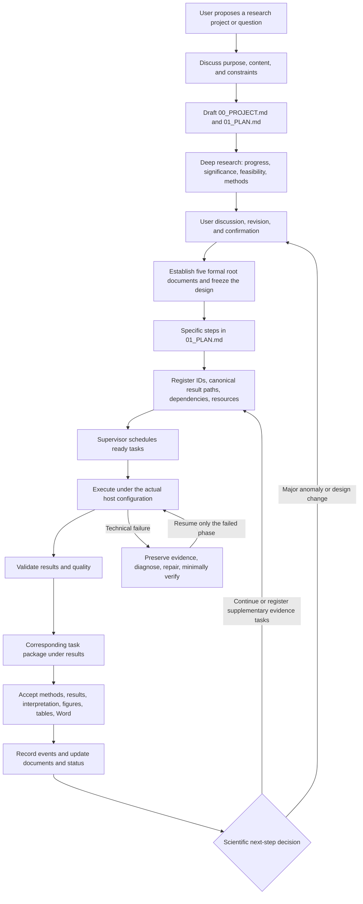

# Scientific Research Agent Design: Research Execution and Reporting

[Chinese guide](README.zh-CN.md)

This project combines an automated research Skill with a Supervisor Agent. Its core is to **execute the approved steps in `01_PLAN.md` and deliver a corresponding, reviewable research package for every step under `results/`**. Following the plan leads researchers directly to each step's data sources, software and methods, actual commands, results, conclusions, scientific interpretation, figures, tables, and Word report.

The Skill defines what each step must do, preserve, explain, and validate. The Supervisor progresses work according to dependencies, resources, and state. Stable task identifiers connect research goals, execution, and reports so researchers can inspect progress, reproduce findings, and resume work.

## 1. Core feature: one planned step, one research package

`00_PROJECT.md` defines scientific questions; `01_PLAN.md` decomposes them into executable tasks; `registry/tasks.tsv` assigns each task one canonical result path. Multiple runs, models, or seed sub-tasks remain inside that task's directory and feed its consolidated report. General research need not become a model-comparison matrix; comparative studies must include all participants approved in their plan.

The following is an organizational example, not an experiment that has already been run:

```text
00_PROJECT.md: Q01 Does a factor affect the study endpoint?
01_PLAN.md: Q01.01 Data quality; Q01.02 Primary comparison
registry/tasks.tsv: one canonical result_path per task
results/
└── Q01_research_question/
    ├── Q01.01_data_quality/
    │   ├── README.md          # Data, methods, results, conclusions, interpretation
    │   ├── REPORT.docx        # Word report consistent with Markdown
    │   ├── tables/            # Statistics, missingness, and failures
    │   ├── figures/           # Figures, legends, and captions
    │   └── _evidence/         # Runs, QC, hashes, and interpretation evidence
    └── Q01.02_primary_analysis/
        ├── README.md
        ├── REPORT.docx
        ├── tables/
        ├── figures/
        └── _evidence/
```

| Package component | Required detail |
|---|---|
| Plan correspondence | Scientific question, task ID, plan version, dependencies, expectations, and links back to the project and plan |
| Data provenance | Dataset description, source link, version, acquisition or access method, actual path, selection criteria, counts, and checksums; reference large raw data without duplicating it |
| Software and methods | Purpose, source, version, environment, checkpoint version, parameters, actual commands, seeds, host, and CPU/GPU resources |
| Results | Values, sample denominators, effect sizes and applicable uncertainty; retain missingness, failures, and approved exclusions |
| Tables and figures | Readable tables, corresponding plots and captions, sources, and generation methods; plotted data trace back to tables and runs |
| Conclusions | Answer this step's scientific question and state what the evidence does and does not support |
| Interpretation and reflection | Expected versus observed findings, mechanisms, alternatives, supporting or conflicting literature, limitations, and downstream impact |
| Human-readable reports | `README.md` and `REPORT.docx` contain consistent values, figures, and conclusions; logs alone are insufficient |
| Acceptance evidence | Run IDs, input/output hashes, QC checks, failure records, and review decisions |

Update corresponding tables, figures, and report drafts as batches are validated; deliver consistent Markdown and Word reports when the formal analysis finishes. Intermediate artifact nodes may release subsequent computation after hash and QC validation; the parent scientific analysis still needs reporting, interpretation, and project-event acceptance. Configured analysis/report workers produce figures, Word documents, and scientific interpretation. The daemon schedules work and checks structure; it does not replace scientific review.

## 2. Architecture: from research question to execution



The five formal root documents establish an agreed project baseline. Unavailable software or data remain explicitly pending; status changes during execution, and design revisions retain approval and version records. “Formal” does not mean installation, downloads, or research have finished.

| File | Purpose |
|---|---|
| `00_PROJECT.md` | Objectives, scientific questions, scope, hypotheses, and final deliverables |
| `01_PLAN.md` | Data, software, methods, dependencies, result paths, and completion criteria for each step |
| `02_SOFTWARE.md` | Software/model descriptions, sources, versions, environments, installation/use, host locations, and validation |
| `03_DATA.md` | Data descriptions, sources/versions, download/access methods, storage, checksums, and splits |
| `04_STATUS.md` | Pending, running, failed, blocked, and complete tasks, with evidence links and next actions |

## 3. The core Skill workflow

1. **Understand the purpose.** Discuss questions, research content, resources, success criteria, and scope with the user.
2. **Draft the plan.** Create preliminary `00_PROJECT.md` and `01_PLAN.md`, preserving hypotheses, candidate methods, and open decisions.
3. **Conduct deep research.** Search foundational and recent work, recording dates, sources, queries, and evidence. Compare conventional, current reproducible, and new methods; assess significance, whether the work is worthwhile, feasibility, and information gain. Recent searches usually cover 24–36 months alongside foundational literature.
4. **Agree on the design.** Present method options, risks, data, and resources. After user confirmation, establish the five formal documents and statistical, exclusion, stopping, and amendment rules.
5. **Prepare each planned step.** Select a dependency-ready step from `01_PLAN.md`; read its data, software, commands, result path, and acceptance criteria.
6. **Execute and document.** Preserve data references, actual methods, and run evidence in the mapped directory; progressively produce tables, figures, results, and reports so outputs remain connected to the plan.
7. **Validate and deliver.** Check counts, denominators, hashes, environments, and failure mechanisms; complete Markdown, Word, and visual deliverables. Explicitly identify unsuccessful checks.
8. **Interpret and reflect.** Answer the task question, compare expectations and literature, and document alternatives, limitations, and the value of downstream work.
9. **Recover or amend.** Diagnose technical failures before bounded repair and phase resume. Discuss major scientific anomalies and frozen-design changes with the user. Register low-risk, valuable supplementary analyses within scope as traceable tasks.
10. **Update and progress.** Project events record downloads, environments, runs, QC, and amendments, updating root documents and status. Authorized, dependency-ready work continues when resources are available.

The [deep-research gate](skills/scientific-research-project/references/deep_research_gate.md) describes the searches, appraisal, and user decisions in steps 3–4. It is an internal operating reference, not a release file. See the [project and result-package schema](skills/scientific-research-project/references/project_schema.md) for deliverable requirements.

## 4. Responsibilities of the Skill and Supervisor

| Component | Responsibility and boundary |
|---|---|
| Core Skill | Guide execution from the plan, maintain task-to-result correspondence, produce reports, and interpret scientific meaning |
| Supervisor CLI | Inspect intake, project, task, and report structure; a single inspection does not start background execution |
| Resident Supervisor | Dispatch configured dependency/resource-ready contracts, track jobs, validate artifacts, and manage retries |
| Analysis, report, and interpretation workers | Invoke domain tools and generate tables, figures, Word, and interpretation; require real commands, environments, and access |
| Project events and status | Connect tasks, runs, and evidence; record failures/amendments and maintain human-facing entry points |

File existence, keyword, and Skill-format checks do not establish scientific correctness. Completion requires actual evidence and review.

## 5. Comparison with Robin and Co-Scientist

This compares organizational emphasis, not performance. Robin includes data analysis and experimental feedback and should not be described as only generating hypotheses. The project column describes this repository's protocol and implementation boundaries.

| Dimension | This project | Robin | Google Co-Scientist |
|---|---|---|---|
| Organizing objective | Execute a research plan and deliver traceable results step by step | Connect literature, hypotheses, experimental data analysis, and updated hypotheses | Generate, critique, and improve hypotheses toward a research objective |
| Human-facing entry points | Five root documents; one result directory and report per planned task | The paper presents experimental plans, analyses, and feedback iterations | The paper presents research proposals and hypothesis iterations |
| Scientific feedback | Compare results with expectations and literature to continue, supplement, or amend | Update hypotheses using experimental findings | Refine hypotheses through multi-agent critique and tournament evolution |
| Format emphasized here | Per-step provenance, methods, results, conclusions, interpretation, figures, tables, and Word | Do not infer that it uses this repository's directory and delivery conventions | Do not infer that it uses this repository's directory and delivery conventions |

Sources: [Robin paper](https://arxiv.org/abs/2505.13400), [Co-Scientist paper](https://arxiv.org/abs/2502.18864). This repository has no direct performance comparison against either system and provides no ready-made integration with them.

## 6. Current execution capabilities and limits

The bundled driver runs **Linux local or SSH-remote user-level systemd jobs**. Hosts need Python, a working user service manager, and task environments; remote hosts also need working SSH access. GPU probing uses `nvidia-smi` for NVIDIA GPU information, which does not establish validation for all accelerator vendors.

| Scope | Current code |
|---|---|
| Local jobs | The driver has local launch/probe paths; the scheduler still requires `host=local` tasks to declare `lightweight: true`. General local GPU-heavy execution is not claimed to be enabled |
| SSH servers | The driver can manage user-level systemd jobs; CPU/GPU resources and task commands require environment-specific verification |
| Containers, Slurm, cloud jobs, and online API scheduling | No bundled dedicated adapters; not listed as current capabilities |

The general documentation does not prescribe H100/V100. `bootstrap_supervisor.py` still contains original-project host defaults that new projects must review and replace. These statements come from code inspection, not new hardware acceptance tests during this documentation change. No backend or scheduler logic was added.

## 7. Installation and use

### 7.1 Obtain the source

If the repository is not yet cloned:

```bash
mkdir -p "$HOME/git"
git clone https://github.com/shuifeng1988/scientific_agent_design.git "$HOME/git/scientific_agent_design"
```

For an existing checkout, preserve local changes before running `git pull --ff-only`. Develop in the source checkout and run from installed copies. The use of `Path.is_relative_to` requires Python 3.9 or newer; this is a code-level minimum, not evidence that every version has been fully tested.

### 7.2 Install for Codex

```bash
research_source="$HOME/git/scientific_agent_design"
research_skill="$research_source/skills/scientific-research-project"
codex_skill="$HOME/.codex/skills/scientific-research-project"
mkdir -p "$codex_skill"
cp -a "$research_skill/." "$codex_skill/"
```

Adjust the destination if using a custom Codex user directory. Invoke `$scientific-research-project` in a new turn/session; reopen the session if updates are not discovered. Check for independent edits in the installed copy before updating.

If the current installation includes the Skill validator:

```bash
python3 "$HOME/.codex/skills/.system/skill-creator/scripts/quick_validate.py" "$codex_skill"
```

This validates Skill structure, not scientific analysis, Word generation, or server execution.

### 7.3 Install for Claude Code

Run from the target research project root, after checking that the destinations do not contain independent edits:

```bash
research_source="$HOME/git/scientific_agent_design"
mkdir -p .claude/skills/scientific-research-project .claude/agents
cp -a "$research_source/skills/scientific-research-project/." .claude/skills/scientific-research-project/
cp "$research_source/adapters/claude/scientific-supervisor.md" .claude/agents/scientific-supervisor.md
```

Reopen the session and invoke the Skill or Supervisor. This installs instructions and adapter files; the bundled `progress_worker.py` uses Codex CLI, so it does not establish acceptance of a resident Claude worker.

### 7.4 Start research and inspect tasks

Give the Agent a concrete request, for example:

> Use scientific-research-project. Discuss my question and draft the project and plan, then conduct deep research and confirm the design with me. Execute the formal 01_PLAN.md step by step, delivering corresponding data sources, methods, results, conclusions, interpretation, tables, figures, and Word reports under results.

Establish formal documents and the task registry after discussion. `project_template/` is a starting point, not an approved protocol; it also does not supply ready-made domain analyses or an implemented project event hook.

Once project files and the task registry are ready, use these inspection/review commands, replacing the path and task ID:

```bash
research_scripts="$HOME/git/scientific_agent_design/skills/scientific-research-project/scripts"
research_project="/absolute/path/to/project"
python3 "$research_scripts/supervisor_agent.py" intake --root "$research_project"
python3 "$research_scripts/supervisor_agent.py" inspect --root "$research_project"
python3 "$research_scripts/supervisor_agent.py" plan --root "$research_project"
python3 "$research_scripts/supervisor_agent.py" review --root "$research_project" --task-id Q01.01
python3 "$research_scripts/supervisor_agent.py" reflect --root "$research_project" --task-id Q01.01
```

These commands do not automatically write a complete research protocol; `plan` alone does not launch all analyses.

### 7.5 Continuous execution, monitoring, and updates

Follow the [continuous execution contract](skills/scientific-research-project/references/continuous_execution.md) to prepare `registry/supervisor.json`: dependencies, actual commands, environments, hosts, resources, hashes, reporting, and interpretation phases. Configure project hooks, reporting tools, and workers. Installing the Skill alone cannot complete a project without these prerequisites.

```bash
research_scripts="$HOME/git/scientific_agent_design/skills/scientific-research-project/scripts"
research_project="/absolute/path/to/project"
python3 "$research_scripts/supervisor_daemon.py" check --root "$research_project"
python3 "$research_scripts/install_supervisor_service.py" --root "$research_project" --start
python3 "$research_scripts/supervisor_daemon.py" status --root "$research_project"
tail -f "$HOME/.codex/monitor/status.md"
```

`--start` starts the service and ready, authorized tasks. The installer depends on an existing `codex-background-monitor.service`; its implementation is not bundled here, so new machines need compatible monitoring configured first. The installer returns the project service name. Stop scheduling with `systemctl --user stop SERVICE_NAME`; separately inspect already-running remote jobs.

Project progress appears in `04_STATUS.md` and `provenance/supervisor/status.md`. Shutdown stops local scheduling; reconcile original job IDs and outputs before resuming. Persistence after logout depends on user lingering settings. See [failure recovery](skills/scientific-research-project/references/failure_recovery.md).

After updating source, copy the Skill again, verify the installed files, and restart services as appropriate. Services use script absolute paths recorded during installation; updating a different copy does not replace those scripts.

## 8. Repository navigation

```text
README.zh-CN.md                    # Chinese introduction and installation
README.en.md                       # Corresponding English guide
VERSION                            # Current version
skills/scientific-research-project/
  SKILL.md                         # Core operating contract
  references/                      # Deep research, packages, recovery, execution
  scripts/                         # Supervisor, driver, checks, tests
adapters/claude/                    # Claude Agent adapter
project_template/                  # Project document templates
documentation/                     # Existing guides/figures; check their versions
archive/                           # Historical material
```

Existing dated DOCX/PDF documents and figures may reflect earlier designs. Use these two READMEs and the corresponding source for current behavior; historical material is not evidence of newly implemented capabilities.

## 9. Version

Current source version: **0.5.1**, recorded in [`VERSION`](VERSION). This update corrects documentation and existing Skill instructions; it adds no execution backend.
