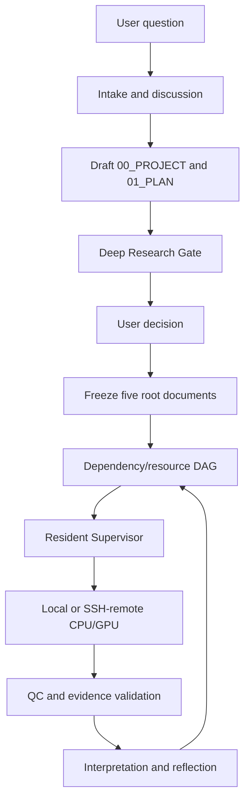

# Scientific Research Agent Design

> Auditable · Explainable · Reproducible · Continuously Executable

Scientific Research Agent Design is an automation framework for real scientific projects. It connects research goals, literature appraisal, protocol design, software and data versions, task dependencies, resource scheduling, execution, QC, interpretation, reflection, and next-step planning into one auditable lifecycle.

## What it provides

- A deep-research gate covering foundational and recent work before plan freeze.
- User-aligned draft `00_PROJECT.md` and `01_PLAN.md`, followed by final frozen `00_PROJECT.md`, `01_PLAN.md`, `02_SOFTWARE.md`, `03_DATA.md`, and `04_STATUS.md`.
- Complete model × dataset × stage dependency DAGs without silently dropping eligible units.
- Evidence-bound outputs: commands, environments, versions, hashes, QC, tables, figures, and conclusions.
- Diagnosis-first recovery: preserve evidence, diagnose, repair, verify, and resume only the failed phase.
- Literature-grounded interpretation comparing expectations, observations, uncertainty, anomalies, and downstream impact.

## Architecture and lifecycle

User research question → Supervisor intake and discussion → draft `00_PROJECT.md`/`01_PLAN.md` → Deep Research Gate → user discussion and decision → final five root documents → dependency/resource DAG → Resident Supervisor → execution on a declared backend → hash/QC validation → interpretation and reflection → next ready task.

## Core Skill workflow

1. Intake and scientific alignment.
2. Draft project and plan.
3. Literature and method deep research.
4. User decision and documented amendments.
5. Freeze the five root documents and registries.
6. Execute all eligible nodes.
7. Diagnose and repair failures.
8. Validate artifacts and scientific release gates.
9. Interpret results against expectations and literature.
10. Continue when dependencies and resources are ready.

## Execution scope

The bundled driver supports local CPU/GPU execution and SSH-connected remote CPU/GPU servers managed with user-level systemd. Docker, Slurm, cloud jobs, and online API adapters are not claimed as built-in features.

## Repository layout

- `skills/scientific-research-project/`: Skill, references, Supervisor scripts, and validation tests.
- `adapters/claude/`: Claude adapter.
- `project_template/`: templates for the five root documents.
- `documentation/`: architecture guides and figures.
- `archive/`: historical, read-only material.

## Installation and validation

Canonical source: `~/git/scientific_agent_design`.

```bash
SOURCE="$HOME/git/scientific_agent_design/skills/scientific-research-project"
TARGET="$HOME/.codex/skills/scientific-research-project"
mkdir -p "$TARGET"
cp -a "$SOURCE/." "$TARGET/"
python3 "$HOME/.codex/skills/.system/skill-creator/scripts/quick_validate.py" "$TARGET"
```

Restart Codex after installation. Run `supervisor_agent.py intake|inspect|plan --root PROJECT`; use `supervisor_daemon.py` for continuous execution and `tail -f ~/.codex/monitor/status.md` for monitoring. For Claude Code, link the Skill into `.claude/skills/scientific-research-project`.

Current release: **0.5.1**.

## Architecture



## Comparison with Robin and Co-Scientist

| Dimension | This framework | Robin / Co-Scientist-style systems |
|---|---|---|
| Focus | Project execution, evidence, and audit | Hypothesis generation, synthesis, and collaboration |
| Freeze gate | Draft → deep research → user decision → freeze | Candidate plans are iterated by agents |
| State | Five root documents, registry, DAG, durable status | Agent trajectories and candidate outputs |
| Evidence | Command, environment, version, hash, QC, tables, figures | Depends on the implementation |
| Recovery | Diagnose before bounded phase-local retry | Primarily reasoning/proposal iteration |
