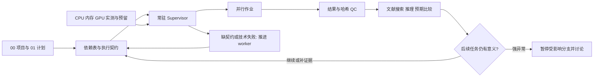

# Scientific Research Agent Design

当前实现：**v0.5.0 execution-first Supervisor**。确定性常驻调度器负责依赖、资源、幂等提交和续跑；AI worker 负责缺契约、诊断修复及科研解读。技术产物校验后放行计算，正式报告与发布独立验收。所有 eligible 模型保留在依赖矩阵，正常规划不耗失败额度；每任务/阶段独立 3 次修复调用及 3 次验证后重试；连续 2 次无实质规划进展显示 stalled，不伪称运行。见 [架构与迁移](skills/scientific-research-project/references/execution_first_architecture.md)、[安装](INSTALL.md)。

这是本项目科研智能体的唯一源代码目录。它同时维护：

1. `scientific-research-project` Skill：规定项目目标、计划、数据、软件、状态、证据和反思协议；
2. Supervisor Agent 实现：通过 `scripts/supervisor_agent.py` 执行 intake、inspect、plan、review 和 reflect；实际持续执行使用 `supervisor_daemon.py`（旧 execute 已禁用）；
3. Claude Code 适配所需的 Skill supporting files 和项目模板；
4. 面向人工阅读的架构说明、安装说明、比较图和研究资料。

## 目录

```text
scientific_agent_design/
├── README.md                         # 本文件
├── INSTALL.md                        # Codex / Claude Code 安装与验证
├── SCIENTIFIC_RESEARCH_AGENT_BLUEPRINT_v0.2.md
├── skills/scientific-research-project/
│   ├── SKILL.md                      # 唯一 Skill 入口
│   ├── references/                   # 项目、intake、反思协议
│   ├── scripts/supervisor_agent.py   # Supervisor CLI 实现
│   └── agents/openai.yaml            # Codex Skill 元数据
├── project_template/                 # 新科研项目的五个根文档模板
├── documentation/                    # Markdown / DOCX / PDF / 图
├── sources/                          # 外部架构资料，仅供设计参考
└── archive/                          # 历史版本，不作为当前实现
```

## 运行约定

每个科研项目根目录必须有：

```text
00_PROJECT.md
01_PLAN.md
02_SOFTWARE.md
03_DATA.md
04_STATUS.md
registry/
provenance/
results/
```

Skill 规定科研协议；常驻 Supervisor 调度已授权的具体执行契约；配置的 worker 完成规划、修复与文献解读。重计算在登记服务器执行，本机仅做轻量编排、编辑、哈希、聚合和报告。依赖与资源满足即自动继续；科学范围变化进入人工讨论。



旧 v0.2 DOCX/PDF 是历史架构说明，未包含 v0.3/v0.4 的实现细节；当前以本页、INSTALL.md、continuous_execution.md 和 failure_recovery.md 为准。自动恢复测试包含调度器模拟与真实小程序执行；不等同于任意科研模型故障都能自动修复。

## 唯一源代码规则

只修改本目录中的 Skill、Supervisor、模板和说明文档。Codex、Claude Code 或其他运行器中的副本都由 `INSTALL.md` 的同步命令生成，不在副本中直接开发。

完整架构说明见：

`documentation/SCIENTIFIC_RESEARCH_AGENT_AND_SUPERVISOR_GUIDE_20260904.md`

其中包含与 Co-Scientist、Robin 的架构比较和推荐混合架构。
