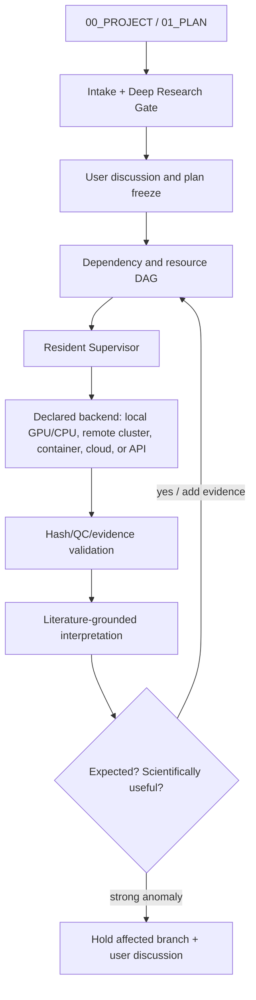

# Scientific Research Agent Design

> **Auditable · Explainable · Reproducible · Continuously Executable**  
> **可审计 · 可解释 · 可复现 · 持续执行**

本项目是一个面向真实科研工作的通用 Skill + Supervisor Agent 框架。它不是单纯的聊天机器人，也不是只会提交作业的调度器，而是把“提出问题—深度调研—制定方案—配置环境与数据—执行—质控—解释—反思—推进下一步”固化为可追踪的科研工作流。

This project provides a general-purpose Skill and Supervisor Agent for real scientific workflows. It is not merely a chatbot or a job scheduler: it turns the complete research loop—question, literature appraisal, protocol design, software/data preparation, execution, QC, interpretation, reflection, and next-step planning—into a traceable, restartable system.

## 项目做什么 / What it does

- 用五个根文档明确项目目标、计划、软件、数据和状态。
- 在冻结新方案前强制进行基础与最新研究的深度文献调研。
- 将模型×数据×阶段展开为带依赖、资源和证据要求的 DAG。
- 按项目声明的执行后端运行任务，可为本地 CPU/GPU、远程服务器或集群、容器环境、云端作业或在线 API；不得把特定显卡写成通用要求。
- 失败时保留证据，诊断原因，定向修复，最小验证后只重跑失败阶段。
- 每个结果都生成方法、数据来源、软件版本、哈希、QC、表、图和人类可读结论。
- 比较观察结果与预期，并评估是否需要补充证据或改变后续任务。

- The five root documents make project intent, plan, software, data, and status explicit.
- A mandatory deep-research gate surveys foundational and recent work before plan freeze.
- The complete model × dataset × stage matrix becomes a dependency/resource/evidence-aware DAG.
- Execution is dispatched to the backend declared by each project: local CPU/GPU, remote server or cluster, container/VM, cloud job, or online API. Local execution is allowed when declared and appropriate.
- Failures follow preserve evidence → diagnose → targeted repair → minimal verification → phase resume.
- Each result package contains methods, data provenance, software versions, hashes, QC, tables, figures, and readable conclusions.
- Observations are compared with preregistered expectations, with downstream scientific impact assessed.

## 架构 / Architecture



核心组件 / Components:

1. `scientific-research-project` Skill：定义科研契约、深度研究门槛、证据和反思规则。
2. Supervisor Agent：执行 intake、inspect、plan、review、reflect。
3. Resident Supervisor Daemon：持续监控、资源感知调度、依赖释放和有限重试。
4. Project template：提供 `00_PROJECT.md`–`04_STATUS.md`、registry、provenance、results 结构。

## 主要优点 / Key advantages

- **可审计 / Auditable**：每次下载、运行、失败、修复和结论都有事件与哈希证据。
- **不漏模型 / Complete coverage**：正式 benchmark 不得静默缩小 eligible 模型面板。
- **可解释 / Explainable**：结果必须说明数据、方法、预期、异常、文献支持和限制。
- **可迁移 / Portable**：服务器、环境、checkpoint、资源和命令均登记，可迁移到其他项目。
- **可恢复 / Recoverable**：任务级失败预算、幂等重试、断点续跑，不盲目重算。
- **持续推进 / Continuous**：依赖满足且资源可用时自动启动后续任务，并区分 daemon 健康和科研进展。

## 目录 / Repository layout

```text
README.md                         # 中英双语总览 / bilingual overview
README.zh-CN.md                   # 中文详细说明
README.en.md                      # English detailed guide
INSTALL.md                        # Codex / Claude 安装与验证
skills/scientific-research-project/
  SKILL.md                        # Skill 入口
  references/                     # 深度研究、失败恢复、执行协议
  scripts/                        # Supervisor 与验证脚本
adapters/claude/                  # Claude 适配
project_template/                 # 五个根文档模板
 documentation/                   # 架构说明、图、DOCX、PDF
archive/                          # 只读历史版本
```

## 版本 / Version

当前版本 / Current release: **0.5.1**。安装方法见 [`INSTALL.md`](INSTALL.md)。深度研究门槛见 [`deep_research_gate.md`](skills/scientific-research-project/references/deep_research_gate.md)。
