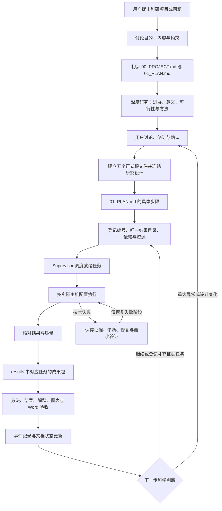

# Scientific Research Agent Design：自动化科研项目执行与报告

[英文说明](README.en.md)

本项目是一套自动化科研 Skill 与 Supervisor Agent，核心是**按照 `01_PLAN.md` 中已确认的具体步骤执行科研分析，并在 `results/` 中为每一步形成一一对应、可复核的研究成果包**。研究人员沿着计划即可找到该步骤的数据来源、软件与方法、实际命令、结果、结论、科学解释、图表和 Word 报告。

Skill 规定“每一步应该做什么、保存什么、如何解释和验收”；Supervisor 结合任务依赖、资源和状态推进工作。项目目标、执行过程和报告通过稳定任务编号关联，便于检查进度、复现结果和接续研究。

## 1. 核心特色：计划中的一步，对应一套研究成果

`00_PROJECT.md` 定义科学问题，`01_PLAN.md` 将问题分解为可执行任务，`registry/tasks.tsv` 为每个任务登记唯一结果路径。多个运行、模型或种子子任务保存在该任务目录内，汇总到同一任务报告。一般科研项目无需强行展开成模型比较矩阵；比较研究则必须覆盖计划批准的全部对象。

下面是目录组织示例，不是已经运行的实验结果：

```text
00_PROJECT.md：Q01 某因素是否影响研究指标？
01_PLAN.md：Q01.01 数据质量检查；Q01.02 主要比较
registry/tasks.tsv：登记每个任务的唯一 result_path
results/
└── Q01_research_question/
    ├── Q01.01_data_quality/
    │   ├── README.md          # 数据、方法、结果、结论与解释
    │   ├── REPORT.docx        # 与 Markdown 结论一致的 Word 报告
    │   ├── tables/            # 统计、缺失记录与失败表
    │   ├── figures/           # 图形、图例和图注
    │   └── _evidence/         # 运行记录、质控、哈希与解释证据
    └── Q01.02_primary_analysis/
        ├── README.md
        ├── REPORT.docx
        ├── tables/
        ├── figures/
        └── _evidence/
```

| 成果包内容 | 具体要求 |
|---|---|
| 计划对应关系 | 科学问题、任务编号、计划版本、依赖和预期；链接回项目与计划 |
| 数据来源 | 数据介绍、来源链接、版本、获取或调用方法、实际路径、筛选条件、样本数和校验值；大型原始数据可引用，不重复拷贝 |
| 软件与方法 | 软件用途、来源、版本、环境、权重版本、参数、实际命令、种子、主机与 CPU/GPU 资源 |
| 结果 | 数值、样本分母、效应量及适用的不确定性指标；完整记录缺失、失败和已批准排除 |
| 表与图 | 可读取结果表、对应图形与图注、来源和生成方法；图中数据可追溯到表与运行 |
| 结论 | 回答本步骤的科学问题，明确证据支持什么、不支持什么 |
| 解释与反思 | 预期与观察是否相符、可能机制、替代解释、文献支持或冲突、局限和下一步影响 |
| 人工可读报告 | `README.md` 与 `REPORT.docx` 使用一致的数值、图表和结论；不能只留下日志 |
| 验收证据 | 运行编号、输入输出哈希、质量检查、失败记录和审阅决定 |

每批结果验证后更新对应表图与报告草案，正式分析完成时交付一致的 Markdown 与 Word 报告。中间数据节点可在哈希与质控通过后供后续计算使用；其所属正式分析仍需完成报告、解释和项目事件验收。图表、Word 和科学解释由实际配置的分析与报告工作程序生成；守护进程负责调度和结构检查，不能替代科学审阅。

## 2. 从研究问题到执行的架构



五个正式根文件是经讨论确立的项目基线。软件或数据尚未就绪时据实标记；状态持续更新，研究设计修改保留审批与版本记录。“正式”不表示安装、下载或研究已经完成。

| 文件 | 用途 |
|---|---|
| `00_PROJECT.md` | 项目目的、科学问题、范围、假设和最终交付 |
| `01_PLAN.md` | 每一步的数据、软件、方法、依赖、结果路径和完成标准 |
| `02_SOFTWARE.md` | 软件与模型介绍、来源、版本、环境、安装使用方法、主机位置与验证 |
| `03_DATA.md` | 数据介绍、来源版本、下载调用方法、存储位置、校验和划分 |
| `04_STATUS.md` | 待执行、进行中、失败、阻断、完成状态，以及证据链接和下一步 |

## 3. 核心 Skill 的逐步工作流

1. **理解目的。** 与用户确认科学问题、研究内容、资源、成功标准和范围。
2. **建立初步计划。** 形成草案 `00_PROJECT.md`、`01_PLAN.md`，保留假设、候选方法和待决问题。
3. **深度研究。** 检索基础与近期进展，记录日期、来源、查询和证据；比较常用、当前可复现和新方法，评价意义、是否值得做、可行性与信息增益。近期窗口通常覆盖过去 24–36 个月，并保留基础文献。
4. **讨论后定案。** 展示方法选项、风险、数据与资源需求；用户确认后建立五个正式根文件，登记统计、排除、停止和修订规则。
5. **按步骤准备。** 从 `01_PLAN.md` 选择依赖已满足的步骤，读取其数据、软件、命令、结果路径和验收要求。
6. **执行与记录。** 在对应目录保存数据引用、实际方法和运行证据，逐批形成表图、结果与报告，避免结果和计划失联。
7. **质控与交付。** 核对行数、分母、哈希、环境和失败机制；完成该步骤的 Markdown、Word 与图表，不通过时明确标记原因。
8. **解释与反思。** 回答任务问题，对比预期、文献支持与冲突，记录替代解释、局限及后续分析的意义。
9. **恢复或修订。** 技术失败先诊断，再有界修复与阶段续跑；重大科学异常和冻结设计变化交由用户讨论。范围内低风险且有价值的补充分析登记为可追踪任务。
10. **更新并推进。** 项目事件记录下载、环境、运行、质控和修订，更新根文件与状态；已授权、依赖满足且资源可用的后续任务继续执行。

[深度研究门槛规范](skills/scientific-research-project/references/deep_research_gate.md)解释第 3–4 步如何检索、评价和记录用户决定，它是内部工作规范，不是版本文件。交付要求见[项目与成果包规范](skills/scientific-research-project/references/project_schema.md)。

## 4. Skill 与 Supervisor 的职责

| 部件 | 职责与边界 |
|---|---|
| 核心 Skill | 指导按计划执行、维持任务与成果一一对应、生成报告并解释科学意义 |
| Supervisor 命令行工具 | 检查需求、项目、任务与报告结构；一次检查不等于开始后台运行 |
| 常驻 Supervisor | 按已配置依赖、执行契约与资源派发任务，跟踪作业、校验产物与管理重试 |
| 分析、报告和解读工作程序 | 调用领域工具，生成表图、Word 与科学解释；需要真实命令、环境和访问权限 |
| 项目事件与状态机制 | 关联任务、运行和证据，记录失败与修订，维护人工入口 |

文件存在性、关键字或 Skill 格式检查均不能证明科学结论正确。完成标准需要实际证据与审阅。

## 5. 与 Robin、Co-Scientist 的定位比较

下表比较工作组织重点，不是性能排名。Robin 已包含数据分析和实验反馈，不能将它描述为仅生成假设。本项目一栏描述自身协议和实现边界。

| 维度 | 本项目 | Robin | Google Co-Scientist |
|---|---|---|---|
| 组织目标 | 按研究计划执行并逐步交付可追溯成果 | 连接文献、假设、实验数据分析和下一轮假设 | 根据研究目标生成、评议与改进假设 |
| 人工检查入口 | 五个根文件；每项计划任务对应唯一结果目录和报告 | 论文展示实验计划、数据分析与反馈迭代 | 论文展示研究提案与假设迭代 |
| 科学反馈 | 结果与预期、文献对照，决定继续、补证据或修订 | 根据实验结果更新假设 | 通过多智能体评议和竞赛演化改进假设 |
| 本项目强调的格式 | 每步的数据来源、方法、结果、结论、解释、表图与 Word | 不据论文推断其采用本仓库目录和交付约定 | 不据论文推断其采用本仓库目录和交付约定 |

依据：[Robin 原始论文](https://arxiv.org/abs/2505.13400)、[Co-Scientist 论文](https://arxiv.org/abs/2502.18864)。本仓库尚无与二者直接比较的性能实验，也未提供二者的即用集成适配。

## 6. 当前执行能力与限制

内置驱动是 **Linux 本地或 SSH 远程的用户级 systemd 驱动**。主机需要 Python、可用的用户服务管理器和任务环境；远程还需可用的 SSH 登录。GPU 探测通过 `nvidia-smi` 获取 NVIDIA GPU 信息，不能宣称所有显卡均已验证。

| 范围 | 当前代码情况 |
|---|---|
| 本地任务 | 驱动有本地启动与探测路径；调度器仍要求 `host=local` 的任务显式声明 `lightweight: true`，不宣称本地 GPU 重计算已通用放开 |
| SSH 服务器 | 驱动可管理用户级 systemd 作业；使用 CPU/GPU 前须按具体环境验证资源和任务命令 |
| 容器、Slurm、云作业与在线 API 调度 | 无内置专用适配器，不列作当前支持能力 |

通用说明不指定 H100/V100。`bootstrap_supervisor.py` 仍含原项目主机默认值，新项目必须审查并替换。以上为代码检查结果，并非这次文档修改完成了新硬件验收；本次未增加后端或修改调度逻辑。

## 7. 安装与使用

### 7.1 获取源码

尚未克隆时执行：

```bash
mkdir -p "$HOME/git"
git clone https://github.com/shuifeng1988/scientific_agent_design.git "$HOME/git/scientific_agent_design"
```

已有源码时，确认本地修改保存后运行 `git pull --ff-only`。源码目录用于开发，安装副本用于运行。源码使用的 `Path.is_relative_to` 要求 Python 3.9 或更新版本；这只是代码最低要求，并非各版本均已完整测试。

### 7.2 Codex 安装

```bash
research_source="$HOME/git/scientific_agent_design"
research_skill="$research_source/skills/scientific-research-project"
codex_skill="$HOME/.codex/skills/scientific-research-project"
mkdir -p "$codex_skill"
cp -a "$research_skill/." "$codex_skill/"
```

自定义 Codex 用户目录需替换目标路径。新会话使用 `$scientific-research-project`，未发现更新时重开会话。更新前检查安装副本是否有独立修改。

若当前安装包含 Skill 校验器：

```bash
python3 "$HOME/.codex/skills/.system/skill-creator/scripts/quick_validate.py" "$codex_skill"
```

此检查仅验证 Skill 结构，不验证科研分析、Word 生成或服务器运行。

### 7.3 Claude Code 安装

在目标科研项目根目录执行；首次安装前确认目标文件没有独立修改：

```bash
research_source="$HOME/git/scientific_agent_design"
mkdir -p .claude/skills/scientific-research-project .claude/agents
cp -a "$research_source/skills/scientific-research-project/." .claude/skills/scientific-research-project/
cp "$research_source/adapters/claude/scientific-supervisor.md" .claude/agents/scientific-supervisor.md
```

重新打开会话调用 Skill 或 Supervisor。这里只安装指令与适配文件；内置 `progress_worker.py` 使用 Codex CLI，不能据此声称 Claude 常驻工作程序已经验收。

### 7.4 开始研究与检查任务

向 Agent 提出具体需求，例如：

> 使用 scientific-research-project。先讨论研究问题并建立初步项目与计划，深度研究后与我确认。按正式 01_PLAN.md 逐步执行，每项分析在 results 中对应交付数据来源、方法、结果、结论、解释、图表和 Word 报告。

讨论后建立正式文件与任务表。`project_template/` 是文档起点，不能把空模板当作已批准方案；模板也不提供现成的领域分析程序或项目钩子实现。

项目文件与任务注册表准备好后，运行下列检查与审阅命令；替换路径和任务编号：

```bash
research_scripts="$HOME/git/scientific_agent_design/skills/scientific-research-project/scripts"
research_project="/absolute/path/to/project"
python3 "$research_scripts/supervisor_agent.py" intake --root "$research_project"
python3 "$research_scripts/supervisor_agent.py" inspect --root "$research_project"
python3 "$research_scripts/supervisor_agent.py" plan --root "$research_project"
python3 "$research_scripts/supervisor_agent.py" review --root "$research_project" --task-id Q01.01
python3 "$research_scripts/supervisor_agent.py" reflect --root "$research_project" --task-id Q01.01
```

这些命令不会自动建立完整方案，也不会仅凭 `plan` 命令启动全部分析。

### 7.5 持续执行、监控与更新

按[持续执行契约](skills/scientific-research-project/references/continuous_execution.md)准备 `registry/supervisor.json`：依赖、实际命令、环境、主机、资源、哈希、报告与解读阶段；配置项目钩子、报告工具及工作程序。缺少这些内容时，仅安装 Skill 不能自动完成项目。

```bash
research_scripts="$HOME/git/scientific_agent_design/skills/scientific-research-project/scripts"
research_project="/absolute/path/to/project"
python3 "$research_scripts/supervisor_daemon.py" check --root "$research_project"
python3 "$research_scripts/install_supervisor_service.py" --root "$research_project" --start
python3 "$research_scripts/supervisor_daemon.py" status --root "$research_project"
tail -f "$HOME/.codex/monitor/status.md"
```

`--start` 会启动服务与就绪的已授权任务。安装器依赖已存在的 `codex-background-monitor.service`，本仓库没有附带其实现，新电脑须先配置兼容监控。安装器返回项目服务名；用 `systemctl --user stop 服务名` 停止调度，已启动远程作业须单独检查。

项目进度见 `04_STATUS.md`、`provenance/supervisor/status.md`。关机时本地调度停止，恢复后先核对原作业编号与输出；注销后维持服务取决于系统用户驻留设置。修复见[失败恢复规范](skills/scientific-research-project/references/failure_recovery.md)。

更新源码后重新复制 Skill，核对副本再按需重启服务。服务使用安装时记录的脚本绝对路径，只更新另一副本不会自动替换它。

## 8. 仓库导航

```text
README.zh-CN.md                    # 中文介绍与安装
README.en.md                       # 对应的英文介绍与安装
VERSION                            # 当前版本号
skills/scientific-research-project/
  SKILL.md                         # 核心行为协议
  references/                      # 深度研究、成果包、恢复与执行规范
  scripts/                         # Supervisor、驱动、检查与测试
adapters/claude/                    # Claude Agent 适配
project_template/                  # 项目文档模板
documentation/                     # 已有架构资料与图形，注意日期版本
archive/                           # 历史资料
```

已有日期版 DOCX、PDF、图形可能反映早期设计；当前说明以两份 README 与对应源码为准。历史材料不作为新增功能已经实现的证明。

## 9. 版本

当前源码版本：**0.5.1**，见 [`VERSION`](VERSION)。本次为文档和已有 Skill 协议的表述修正，没有新增执行后端。
