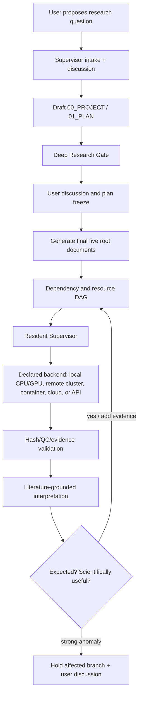

# Scientific Research Agent Design

> **Auditable · Explainable · Reproducible · Continuously Executable**  
> **可审计 · 可解释 · 可复现 · 持续执行**

本项目是一套面向真实科研项目的自动化科研 Skill + Supervisor Agent。它把研究目标、文献证据、实验/计算方案、软件与数据版本、任务依赖、执行资源、质量控制和科学结论组织成一个可持续运行的项目系统。其独特之处是：先通过深度研究和用户讨论冻结问题，再按完整计划自动执行；每个结果都绑定方法、数据、环境、哈希、QC、图表和解释；失败时诊断后定向修复；发现异常时比较预期与证据并决定补充实验或暂停讨论。

This project is an automation layer for real scientific projects: a Skill plus a Supervisor Agent that connects research goals, literature evidence, protocols, software/data versions, dependencies, execution resources, QC, and scientific conclusions. Its distinctive design is a gated and auditable lifecycle: perform deep research and user alignment before freezing the plan; execute the complete registered workflow; bind every result to methods, data, environments, hashes, QC, figures, and interpretation; diagnose before retrying; and use expectation-versus-evidence reflection to trigger supplementary experiments or discussion.

## 与其他科研智能体的区别 / Difference from other research agents

Robin、Google AI Co-Scientist 等系统强调多智能体协作、假设生成、文献综合和方案建议。本项目在这些能力之外，专门强化科研项目的“执行与证据层”：

| 维度 / Dimension | 本项目 / This framework | Robin / Co-Scientist 类系统 |
|---|---|---|
| 研究入口 | 用户讨论 → 初步方案 → 深度研究门槛 → 正式冻结 | 通常从问题或假设生成开始 |
| 项目管理 | 五个根文件、任务 registry、依赖 DAG、持久状态 | 侧重代理轨迹和候选方案 |
| 执行可追溯性 | 每次运行绑定环境、版本、输入输出哈希、QC 和结果路径 | 依具体系统，通常不是统一项目契约 |
| 失败恢复 | 保留证据 → 诊断 → 定向修复 → 最小验证 → 续跑 | 重点通常在推理/提案迭代 |
| 科学发布 | 结果、图表、方法、限制和文献反思组成可审计报告 | 重点通常是候选假设、实验设计或综合结论 |
| 可迁移性 | 后端可声明为本地、GPU、集群、容器、云或 API | 依赖具体平台和工具链 |

因此，本项目定位为“科研智能体的项目执行与证据基础设施”：可与文献、假设生成和领域分析 Agent 组合，而不是替代它们。

## 项目做什么 / What it does

- 用五个根文档明确项目目标、计划、软件、数据和状态。
- 在冻结新方案前强制进行基础与最新研究的深度文献调研。
- 将模型×数据×阶段展开为带依赖、资源和证据要求的 DAG。
- 按项目声明的执行后端运行任务，可按项目声明使用本地 CPU/GPU、远程服务器或集群、容器、云端作业或在线 API；当前内置驱动实际支持本地或 SSH 远程 systemd，其他后端需实现兼容 driver adapter。
- 失败时保留证据，诊断原因，定向修复，最小验证后只重跑失败阶段。
- 每个结果都生成方法、数据来源、软件版本、哈希、QC、表、图和人类可读结论。
- 比较观察结果与预期，并评估是否需要补充证据或改变后续任务。

- The five root documents make project intent, plan, software, data, and status explicit.
- A mandatory deep-research gate surveys foundational and recent work before plan freeze.
- The complete model × dataset × stage matrix becomes a dependency/resource/evidence-aware DAG.
- Execution is dispatched to the backend declared by each project. The bundled driver currently supports local or SSH-remote systemd jobs; local CPU/GPU, containers, schedulers, cloud jobs, and online APIs are supported only when a compatible project driver adapter is configured and verified.
- Failures follow preserve evidence → diagnose → targeted repair → minimal verification → phase resume.
- Each result package contains methods, data provenance, software versions, hashes, QC, tables, figures, and readable conclusions.
- Observations are compared with preregistered expectations, with downstream scientific impact assessed.

## 架构 / Architecture



核心组件 / Components:

1. `scientific-research-project` Skill：定义科研契约、深度研究门槛、证据和反思规则。
2. Supervisor Agent：执行 intake、inspect、plan、review、reflect。
3. Resident Supervisor Daemon：持续监控、资源感知调度、依赖释放和有限重试。
4. Project template：提供 `00_PROJECT.md`–`04_STATUS.md`、registry、provenance、results 结构。

## 核心 Skill 工作流 / Core Skill workflow

1. **Intake / 需求理解**：识别研究目的、科学决策、假设、对象、数据、模型、终点、约束和预期；记录高影响待决问题。
2. **Draft / 初步方案**：与用户讨论后，仅生成初步 `00_PROJECT.md` 和 `01_PLAN.md`，明确问题边界与候选分析。
3. **Deep research gate / 深度研究门槛**：检索基础及最新文献，建立证据图谱，比较常规、当前和前沿方法，评估意义、创新性、可行性、资源和信息增益。
4. **User decision / 用户决策**：向用户呈现研究价值、方法选项、风险和 go/no-go 或分阶段建议；记录确认、异议和修改。
5. **Freeze / 正式冻结**：确认后才生成最终五个根文件、registry、数据/软件版本、split、统计、排除和资源契约。
6. **Execute / 执行**：将完整 eligible 模型×数据×阶段展开为 DAG，在项目声明的本地、远程、容器、云端或 API 后端运行。
7. **Recover / 故障恢复**：保留日志和哈希，诊断原因，定向修复，最小验证，只恢复失败阶段，并限制任务级重试额度。
8. **QC and release / 质控发布**：核对输入输出哈希、行数、环境、失败表、表图和报告；artifact readiness 与 scientific release 分离。
9. **Interpret and reflect / 解读反思**：比较预期与观察，检索支持和冲突证据，解释异常和限制，判断后续任务价值，必要时提出补充证据或用户讨论。
10. **Continue / 持续推进**：依赖和资源满足即调度下一节点；所有状态、事件和结果路径持久化，支持中断后恢复。

## 主要优点 / Key advantages

- **可审计 / Auditable**：每次下载、运行、失败、修复和结论都有事件与哈希证据。
- **不漏模型 / Complete coverage**：正式 benchmark 不得静默缩小 eligible 模型面板。
- **可解释 / Explainable**：结果必须说明数据、方法、预期、异常、文献支持和限制。
- **可迁移 / Portable**：服务器、环境、checkpoint、资源和命令均登记，可迁移到其他项目。
- **可恢复 / Recoverable**：任务级失败预算、幂等重试、断点续跑，不盲目重算。
- **持续推进 / Continuous**：依赖满足且资源可用时自动启动后续任务，并区分 daemon 健康和科研进展。

## 目录 / Repository layout

```text
README.md                         # 中英双语总览 / bilingual overview
INSTALL.md                        # Codex / Claude 安装与验证
skills/scientific-research-project/
  SKILL.md                        # Skill 入口
  references/                     # 深度研究、失败恢复、执行协议
  scripts/                        # Supervisor 与验证脚本
adapters/claude/                  # Claude 适配
project_template/                 # 五个根文档模板
 documentation/                   # 架构说明、图、DOCX、PDF
archive/                          # 只读历史版本
```

## 版本 / Version

当前版本 / Current release: **0.5.1**。安装方法见 [`INSTALL.md`](INSTALL.md)。深度研究门槛见 [`deep_research_gate.md`](skills/scientific-research-project/references/deep_research_gate.md)。

## 安装与验证

唯一源代码目录为 `~/git/scientific_agent_design`。

### Codex 用户级安装

```bash
SOURCE="$HOME/git/scientific_agent_design/skills/scientific-research-project"
TARGET="$HOME/.codex/skills/scientific-research-project"
mkdir -p "$TARGET"
cp -a "$SOURCE/." "$TARGET/"
python3 "$HOME/.codex/skills/.system/skill-creator/scripts/quick_validate.py" "$TARGET"
```

安装后重启 Codex。

### Supervisor

```bash
python3 "$TARGET/scripts/supervisor_agent.py" intake --root /path/to/project
python3 "$TARGET/scripts/supervisor_agent.py" inspect --root /path/to/project
python3 "$TARGET/scripts/supervisor_agent.py" plan --root /path/to/project
```

持续执行使用 `supervisor_daemon.py`，监控使用 `tail -f ~/.codex/monitor/status.md`。

### Claude Code

```bash
mkdir -p .claude/skills
ln -s ~/git/scientific_agent_design/skills/scientific-research-project .claude/skills/scientific-research-project
```
