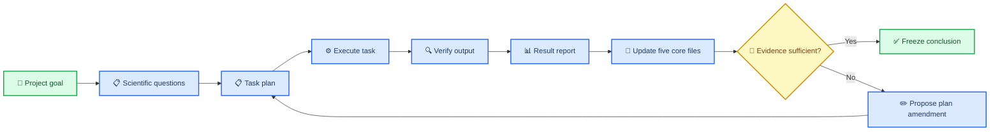
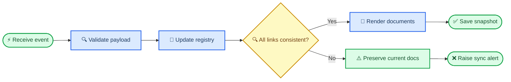

# 通用科研智能体总体设计 v0.2

_修正版：五个根目录核心文件、科学问题驱动的结果树、事件钩子和受控计划修订。_

---

## 🎯 唯一主线

每个项目必须由科学问题驱动，执行任务和结果不能建立平行编号体系：



## 📋 根目录五个核心文件

人进入任何项目根目录，只需要先看以下五个文件：

| 文件 | 内容 | 更新触发器 |
|---|---|---|
| `00_PROJECT.md` | 总体目标、科学问题、假设、范围、最终交付 | 目标批准、范围变更 |
| `01_PLAN.md` | 问题→子问题→任务 DAG；软件、数据、命令、输出位置 | 计划批准、任务完成、计划修订 |
| `02_SOFTWARE.md` | 软件/模型用途、版本、来源、安装、环境、调用和 smoke | 下载、安装、smoke、版本变更 |
| `03_DATA.md` | 数据介绍、来源、下载/API、版本、路径、QC 和任务用途 | 下载、校验、标准化、split |
| `04_STATUS.md` | 全任务状态、进度、失败、阻断、下一步、结果链接 | 任意状态事件 |

机器台账可放在 `registry/`，但五个 Markdown 文件必须始终是同步的人类入口。

## 🗂️ 项目目录

```text
project_slug/
├── 00_PROJECT.md
├── 01_PLAN.md
├── 02_SOFTWARE.md
├── 03_DATA.md
├── 04_STATUS.md
├── data/
│   ├── raw/
│   ├── processed/
│   ├── splits/
│   └── qc/
├── software/
│   ├── source/
│   ├── weights/
│   ├── containers/
│   └── environments/
├── results/
│   ├── README.md
│   ├── PROJECT_REPORT.md
│   ├── PROJECT_REPORT.docx
│   └── Q01_question_slug/
│       └── Q01.01_task_slug/
│           ├── README.md
│           ├── REPORT.docx
│           ├── tables/
│           ├── figures/
│           └── _evidence/
├── scripts/
│   ├── workflows/
│   ├── adapters/
│   ├── reporting/
│   └── hooks/
├── registry/
│   ├── tasks.tsv
│   ├── software.tsv
│   ├── data.tsv
│   ├── runs.tsv
│   ├── artifacts.tsv
│   └── claims.tsv
├── provenance/
│   ├── events.jsonl
│   ├── decisions.tsv
│   └── plan_amendments/
└── archive/
```

根目录不放零散报告。技术日志、分片、中间文件和哈希进入 `_evidence/`；旧版本进入 `archive/`。

## 🔗 项目、计划与结果的强制对应

编号只有一套：

```text
Q01                    科学问题
Q01.01                 子问题/可执行任务
Q01.01.R001            第一次正式运行
Q01.01.R002            修复后的第二次运行
results/Q01_.../Q01.01_.../    唯一结果目录
```

`00_PROJECT.md` 定义 `Q01`；`01_PLAN.md` 定义 `Q01.01`、使用的软件/数据、依赖和结果路径；结果 README 必须反向链接二者。不存在脱离计划的 `stage4`、`final2`、`new_results` 等目录。

`01_PLAN.md` 的每个任务必须预登记：科学目的、完整 eligible 方法、数据 ID、软件 ID、环境、串并联关系、完整命令、资源、预计时间、主要/次要终点、QC、失败策略、表图、Word/Markdown 和唯一 `result_path`。

## 📊 每个结果目录的内容

每个 `results/Qxx/Qxx.xx/README.md` 按固定顺序包含：

1. 对应的项目目标与科学问题
2. 对应的计划任务和 plan version
3. 数据介绍、来源、版本、调用方式、样本和哈希
4. 软件/模型用途、版本、环境、安装与调用方法
5. 实际执行命令、服务器、资源、seed 和 run ID
6. QC、覆盖率、失败/排除和复现性
7. 每项结果对应的表和图
8. 统计结果、科学结论和证据强度
9. 与预期是否一致、异常解释和限制
10. 下一步、是否需要补证据或修改计划

人类可见文件只有 `README.md`、`REPORT.docx`、`tables/` 和 `figures/`。命令、日志、锁文件、输入输出哈希、失败行和 QC JSON 放 `_evidence/`。

项目总报告位于 `results/PROJECT_REPORT.md/.docx`，只整合已冻结结论；它的章节编号同样按 `Q01`、`Q02` 排列。

## ⚙️ 软件与数据要求

`02_SOFTWARE.md` 每个软件/模型一行，记录用途、论文/官方来源、许可证、版本/commit、checkpoint hash、安装命令、Docker/conda、激活命令、调用命令、服务器/GPU、资源要求、双次 smoke、失败率和替代方案。

`03_DATA.md` 每个数据源一行，记录科学含义、官方 URL/DOI/API、许可、访问日期、下载/API 命令、认证/分页/重试、原始与处理路径、checksum、schema、样本量、缺失/重复、单位、ID 映射、split、leakage、QC 和实际使用任务。

下载成功不等于数据 ready；安装成功不等于软件 ready。只有 checksum/QC/smoke 通过后，hook 才能把状态升级为 `verified` 或 `ready`。

## ⚡ 事件钩子

每个下载、安装、运行和验证事件必须先写入不可变 `provenance/events.jsonl`。hook 使用 `event_id` 和 idempotency key 防止重复更新：

| 事件 | 验证 | 自动更新 |
|---|---|---|
| `data.download.completed` | 存在、大小、checksum、远端 checksum | `03_DATA.md`、data registry、`04_STATUS.md` |
| `data.standardization.completed` | schema、行数、缺失、重复、split、QC | `03_DATA.md`、相关任务 readiness |
| `software.download.completed` | 官方来源、版本、commit/checkpoint hash | `02_SOFTWARE.md`、software registry |
| `software.smoke.passed` | 双次输出、一致性、环境和资源 | `02_SOFTWARE.md`、任务 readiness |
| `run.started/progress` | host、PID/job、心跳、总工作量 | `04_STATUS.md` |
| `run.completed` | 退出码、预期文件、行数、hash | 任务结果 README 草稿、计划与状态 |
| `run.failed` | stderr、退出码、失败类别 | `04_STATUS.md`、结果反思、证据目录 |
| `qc.passed` | 数值、覆盖率、重复性、统计门禁 | 表图、结论、Word、`01_PLAN.md`、`04_STATUS.md` |
| `qc.failed` | 失败项、影响范围、所需证据 | 状态、结果反思、plan amendment 草案 |
| `plan.amendment.approved` | 原因、证据、影响、批准人和 diff | 新 plan version、状态、受影响结果 |



事务顺序是 `event → registry transaction → consistency check → Markdown/Word render → snapshot`。任何一步失败都不覆盖上一版有效文档，并在 `04_STATUS.md` 产生 `documentation_sync_failed` 告警。

## 🔍 计划修订与结果反思

不一致结果或证据缺口可以触发计划修改，但不能静默改写冻结计划：

1. Critic 创建 `plan_amendment` 草案
2. 记录触发结果、异常、替代解释和影响范围
3. 区分技术修复、预设敏感性分析和 post hoc 新分析
4. 人类批准后生成新 plan version
5. 保留旧任务、旧结果和旧结论，不覆盖历史
6. 新任务获得新 ID，并链接原任务

技术失败可按原合同重试；数据问题先隔离和重新 QC；统计假设失败使用预先规定的稳健方案；反常结果先复核单位、方向、泄漏、实现和对照；阴性结果如实报告；新增探索必须标为 post hoc 并要求独立验证。

## 📍 状态真实性

`04_STATUS.md` 必须由 registry 和事件生成，至少显示：`task_id`、父问题、状态、完成/总量、百分比、host/job、时间、ETA、attempt、失败类别、阻断、下一动作、结果链接和最近心跳。

状态只允许：`draft`、`approved`、`ready`、`running`、`validating`、`reviewing`、`complete`、`frozen`、`failed`、`blocked`、`excluded`。

只有进程结束、输出存在、行数/哈希/QC 通过、表图和报告齐全、结果与计划互链后，才能标 `complete`；只有结论和全部证据 hash 固定后才能标 `frozen`。

## 🛡️ 防偏航规则

Supervisor 每次行动前必须读取根目录五文件并回答：当前服务哪个 `Qxx`？执行哪个 `Qxx.xx`？完整 eligible 方法是否列齐？数据/软件是否 ready？结果目录是否预登记？QC/失败策略是什么？完成事件要更新哪些文档？

如果新请求不属于当前 `00_PROJECT.md`，必须创建新项目或请求用户批准范围变更，不能混入当前项目。

## 👥 多智能体分工

Supervisor 负责目标和调度；Evidence/Hypothesis/Methodologist 负责检索、假设和计划；Environment/Data Steward 负责软件和数据；Executor/Statistician 负责执行和统计；Critic/Auditor 独立检查；Reporter 只使用审计通过的结果生成 Markdown、Word、表和图。

Co-Scientist 的 Supervisor、异步 worker、生成—反思—排名—演化和持久上下文，以及 Robin 的文献代理、数据分析代理、多条分析轨迹和实验反馈闭环是本设计的重要参考。[^1][^2] 本设计额外把任务—数据—软件—命令—结果—结论的可追溯关系与自动文档钩子设为硬约束。

## ✅ 验收标准

- 根目录五个核心文件始终存在且相互一致
- `00_PROJECT.md` 中每个科学问题都能映射到计划任务和结果目录
- `01_PLAN.md` 中每个正式任务都有唯一结果路径
- 每个结果 README 都包含数据来源、软件用法、实际命令、表、图、结果和结论
- 每次成功下载、安装、运行、QC 或失败都产生事件并更新相应文档
- 计划变更具有原因、证据、版本、diff 和人工批准
- 任意结论可追溯到 task、run、表/图、输入 hash、数据和软件版本
- 智能体重启后仅依靠磁盘状态即可继续，不依赖聊天记忆

## 📚 参考文献

[^1]: Gottweis, J. et al. (2026). “Accelerating scientific discovery with Co-Scientist.” *Nature*. https://www.nature.com/articles/s41586-026-10644-y

[^2]: Ghareeb, A. E. et al. (2026). “A multi-agent system for automating scientific discovery.” *Nature*. https://www.nature.com/articles/s41586-026-10652-y

