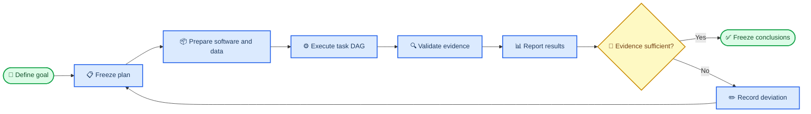
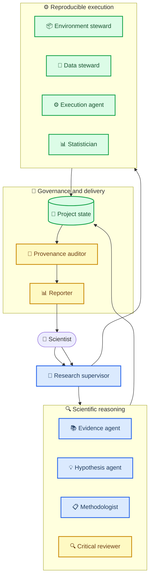
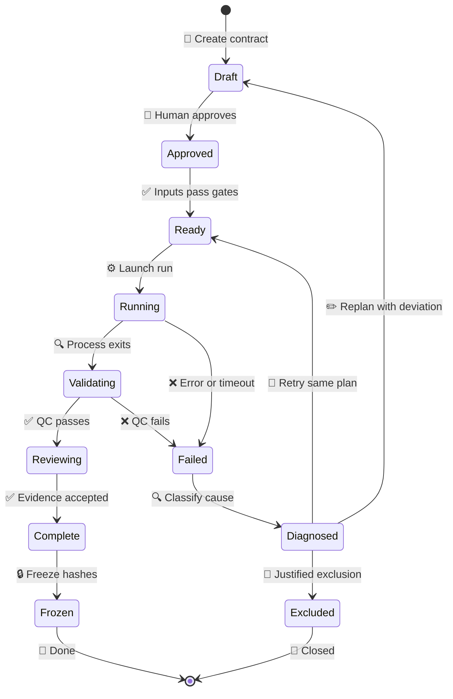

# 通用科研智能体总体设计 v0.1

_目标：构建可规划、可执行、可审计、可反思、可恢复，并能向人类清晰汇报的通用科研多智能体系统。设计日期：2026-09-03。_

---

## 🎯 设计结论

本系统不是以聊天记录为记忆中心，而是以一个版本化的**科研项目状态**为中心。任何智能体重启后，都必须从项目目标、计划、软件、数据、任务、运行证据和结论文件恢复工作，不能依靠“记得上次说过什么”。

系统的唯一主线是：



Co-Scientist 提供了 Supervisor、异步 worker、Generation、Reflection、Ranking、Evolution、Proximity、Meta-review 和持久上下文的设计参考；Robin 展示了文献检索代理、数据分析代理、实验反馈和再次提出假设的连续闭环。[^1][^2] 本设计吸收这些机制，但增加更严格的项目治理、运行证据和人类可读交付。

## 🏗️ 总体架构

### 四个系统层

| 系统层 | 负责内容 | 不允许发生的事 |
|---|---|---|
| 科学治理层 | 目标、假设、问题树、成功标准、排除规则 | 执行中静默改变目标 |
| 科研推理层 | 文献、计划、方法选择、批判、统计和解释 | 单一代理既生成又自行批准结论 |
| 工程执行层 | 环境、数据、代码、调度、监控、QC、哈希 | 只凭日志文字宣称完成 |
| 人类交付层 | 状态表、独立任务报告、图表、Word、总报告 | 把数百个中间文件直接暴露为入口 |

### 多智能体角色



| 智能体 | 职责 | 主要输入 | 必须输出 | 权限边界 |
|---|---|---|---|---|
| Research Supervisor | 解析目标、建立问题树、调度、判断门禁 | 用户目标、项目状态 | 冻结计划、任务 DAG、资源分配 | 不能自行批准高风险偏离 |
| Evidence Agent | 快速/深度文献检索、证据抽取、引用核验 | 科学问题、数据库/API | 证据表、引文、矛盾证据 | 不直接形成最终因果结论 |
| Hypothesis Agent | 生成候选假设、预测和可证伪条件 | 证据图、目标约束 | 假设卡片 | 不选择自己的获胜假设 |
| Methodologist | 设计实验、对照、切分、指标和统计计划 | 假设、数据可得性 | 预注册式任务合同 | 结果产生后不得静默换终点 |
| Critical Reviewer | 找漏洞、替代解释、泄漏和偏倚 | 假设、计划、结果 | 批评清单、修订建议 | 与生成代理逻辑隔离 |
| Environment Steward | 软件介绍、来源、版本、安装和 smoke | 方法需求、服务器资源 | 软件台账、锁文件、验证证据 | 未通过 smoke 不可标 ready |
| Data Steward | 数据介绍、来源、许可、下载、标准化和 lineage | 任务合同、数据源 | 数据台账、快照、QC、哈希 | 不得静默删除失败样本 |
| Execution Agent | 生成/执行命令、调度远程资源、监控和重试 | 已批准任务合同 | run manifest、日志、产物 | 只能执行合同允许的动作 |
| Statistician | 假设检验、效应量、不确定性、多重校正 | 冻结结果、统计方案 | 统计表、诊断图、限制 | 不以显著性替代科学意义 |
| Provenance Auditor | 校验输入输出、版本、覆盖率和状态 | 全部 manifest 和产物 | 审计结论、冻结哈希 | 证据不全不能标 complete |
| Reporter | 生成 Markdown、Word、表格、图和摘要 | 审计通过的结果 | 人类可读任务报告和总报告 | 不引用未冻结中间结果 |

智能体不是始终全部并行运行。Supervisor 根据任务类型只激活需要的角色；Critic 与 Auditor 必须独立于执行者。

## 📋 七个核心项目文件

每个科研项目根目录只向人类暴露七个核心文件：

| 文件 | 回答的问题 | 更新责任 |
|---|---|---|
| `00_PROJECT.md` | 为什么做、要回答什么、最终交付什么 | Scientist + Supervisor |
| `01_PLAN.md` | 大问题、子问题、任务 DAG、模型/方法和数据 | Methodologist |
| `02_SOFTWARE.md` | 每个软件做什么、版本、来源、安装、使用、服务器 | Environment Steward |
| `03_DATA.md` | 每个数据是什么、来源、许可、下载/API、路径、版本、QC | Data Steward |
| `04_STATUS.md` | 全任务当前状态、进度、失败、阻断和下一步 | Supervisor 自动生成 |
| `05_DECISIONS.md` | 偏离、失败处理、方法变更和人类批准 | Critic + Scientist |
| `06_REPORT.md` | 冻结结果、图表、结论、限制和后续研究 | Reporter + Auditor |

`06_REPORT.docx` 由同一 Markdown 内容生成，防止 Word 与 Markdown 结论不一致。详细机器台账放在 `registry/`，中间技术证据放在任务的 `_evidence/`，不污染根目录。

### 推荐目录结构

```text
project_slug/
├── 00_PROJECT.md
├── 01_PLAN.md
├── 02_SOFTWARE.md
├── 03_DATA.md
├── 04_STATUS.md
├── 05_DECISIONS.md
├── 06_REPORT.md
├── 06_REPORT.docx
├── registry/
│   ├── tasks.tsv
│   ├── software.tsv
│   ├── data.tsv
│   ├── runs.tsv
│   ├── artifacts.tsv
│   ├── claims.tsv
│   └── events.jsonl
├── tasks/
│   └── Q01/
│       └── Q01.01_task_slug/
│           ├── README.md
│           ├── REPORT.md
│           ├── REPORT.docx
│           ├── results/
│           │   ├── tables/
│           │   └── figures/
│           └── _evidence/
│               ├── task.yaml
│               ├── commands.sh
│               ├── environment.lock
│               ├── inputs.sha256
│               ├── outputs.sha256
│               ├── logs/
│               └── qc.json
└── archive/
```

## 🎯 目标与问题树

`00_PROJECT.md` 必须在执行前冻结以下内容：

| 字段 | 要求 |
|---|---|
| Project objective | 一句话说明最终要回答的科学问题 |
| Scientific questions | 3–8 个大问题，使用 `Q01`、`Q02` 编号 |
| Hypotheses | 每个问题至少一个可证伪假设和空假设 |
| Expected evidence | 支持、反驳和不确定分别长什么样 |
| Deliverables | 数据、代码、图表、任务报告、总报告 |
| Scope | 明确包含和不包含什么 |
| Success criteria | 定量/定性验收标准 |
| Stop criteria | 何时停止、降级或排除 |
| Human approvals | 哪些节点必须人工确认 |

问题编号必须稳定。执行阶段只能挂到问题下面，例如 `Q01.03.R002` 表示科学问题 1、子问题 3、第二次运行，不能另建一套与科学问题平行的阶段命名。

## ✍️ 具体规划与任务合同

`01_PLAN.md` 展示人类可读问题树和任务 DAG；每个可执行任务另有 `_evidence/task.yaml`。任务进入 `ready` 前必须具备完整合同：

| 合同部分 | 必填内容 |
|---|---|
| Identity | `task_id`、父问题、版本、负责人 |
| Scientific intent | 科学问题、假设、预期方向、替代解释 |
| Inputs | 数据 ID、行/样本范围、哈希、依赖任务 |
| Methods | 软件/模型 ID、版本、参数、对照、随机种子 |
| Execution | 串并联 DAG、完整命令、服务器、CPU/GPU/RAM、预计时间 |
| Statistics | 主终点、次终点、效应量、CI、检验、多重校正 |
| Outputs | 表、图、模型、日志、Markdown/Word 报告的精确路径 |
| QC gates | 输入、运行、数值、覆盖率、复现性和科学合理性阈值 |
| Failure policy | 超时、OOM、坏样本、软件错误、统计失败如何处理 |
| Decision rule | 何时 complete、failed、excluded、replan |

计划必须先列出所有 eligible 方法，再通过可审计 gate 排除；不得先挑少数容易运行的模型再称为正式比较。

## ⚙️ 软件与环境管理

`02_SOFTWARE.md` 是人类入口，`registry/software.tsv` 是逐软件机器台账。每个软件或模型一行，至少包含：

- 名称、用途和适用任务
- 论文、官方仓库和许可证
- 精确版本、commit、checkpoint 与 SHA-256
- H100/V100/CPU/云服务位置
- Docker image digest 或 conda lock
- 安装命令、激活命令、正式调用命令
- 最低 CPU/RAM/GPU/显存要求
- 双次 deterministic smoke 输入、输出和差异
- 已知限制、失败率和替代方案

Robin 的 Finch 使用固定 Docker 分析环境，把分析能力与依赖安装问题隔离，这是应吸收的设计。[^2] 本系统进一步要求每个正式软件都经过 `install → version check → smoke-1 → smoke-2 → hash compare → ready` 门禁。

## 💾 数据与网络资源管理

`03_DATA.md` 对每个数据集或网络数据源给出介绍和调用方法；`registry/data.tsv` 保存可计算字段：

| 类别 | 必填字段 |
|---|---|
| Identification | `data_id`、名称、版本、发布日期 |
| Scientific meaning | 样本是什么、标签如何产生、适用/不适用问题 |
| Source | 官方 URL、DOI、数据库/API、许可和访问日期 |
| Acquisition | 下载/API 命令、认证、分页、重试和 checksum |
| Storage | 原始、标准化、split、QC 和服务器路径 |
| Standardization | 清洗、单位、ID 映射、缺失/重复处理 |
| Leakage | exact、实体、时间、群落、预训练 overlap |
| Quality | 行数、失败数、分布、异常值、完整性和哈希 |
| Usage | 哪些任务、哪些字段、哪些 split 实际调用 |

外部 API 响应必须保存原始快照、请求参数、时间戳和响应哈希；否则未来无法复现。远程服务器网络不稳定时，可本机下载、校验后上传，但还要验证远端哈希。

## ⚙️ 任务执行与产物合同

每个任务的 `README.md` 是人类唯一入口，必须按固定顺序写：目的、输入、软件/环境、命令、QC、结果表、结果图、结论、限制、下一步。执行命令保存在 `_evidence/commands.sh`，既可包含串行依赖，也可描述并行分片。

每次正式运行产生一个不可变 `run_id`，并保存：

- 完整命令和参数
- 主机、GPU、CPU、RAM、开始/结束时间
- conda/Docker、包版本、代码 commit
- 输入/输出哈希、随机种子、checkpoint
- stdout/stderr、退出码、峰值资源、完成单位/总单位
- 行级失败表和重试关系

Reporter 只有在 Auditor 验证表格、图、哈希和样本数一致后，才能生成 `REPORT.md` 与 `REPORT.docx`。

### 每个任务的标准输出

| 人类可见输出 | 内容 |
|---|---|
| `REPORT.md` | 方法、主要结果、图表、结论和限制 |
| `REPORT.docx` | 与 Markdown 同源的 Word 版本 |
| `results/tables/` | 主结果、QC、失败和敏感性表 |
| `results/figures/` | 每项主要结果对应 PDF+PNG；含标题、样本量、误差和说明 |
| `_evidence/` | 命令、环境、日志、哈希和机器 QC；默认不让普通用户逐个浏览 |

## 📍 状态与恢复机制

`04_STATUS.md` 由 `registry/tasks.tsv` 和不可变 `events.jsonl` 自动生成，不能手工编写一个与实际运行脱节的状态故事。



状态表至少包含：`task_id`、父问题、状态、完成/总单位、百分比、服务器、job/PID、开始时间、ETA、最近心跳、尝试次数、失败类别、下一动作、证据路径和负责人。

**完成**必须满足：进程结束、预期文件存在、行数/哈希/QC 通过、表图报告齐全、Auditor 签核。仅有日志或部分输出不能标 complete。

## 🔍 结果解释与反思

Reflection 不是看到结果后随意增加分析，而是一个受控决策环：

| 现象 | 首先检查 | 允许动作 | 必须记录 |
|---|---|---|---|
| 程序失败/OOM/超时 | 退出码、资源、坏样本 | 修复工程问题后同协议重试 | 根因、修改、旧/新 run ID |
| 数据质量失败 | 格式、单位、重复、缺失、泄漏 | 隔离问题数据并重新标准化 | 受影响行和 cohort 变化 |
| 统计假设不满足 | 分布、独立性、方差、样本量 | 使用预先规定的稳健/非参数方案 | 主分析与敏感性分析分开 |
| 结果与预期相反 | 数据、方向、实现、对照、文献 | 复核并做独立重复 | 原假设不能被改写成事后正确 |
| 结果异常但可信 | 极端值、亚组、批次、外部证据 | 新建探索性子任务 | 标记 post hoc，后续独立验证 |
| 阴性结果 | 功效、CI、最小效应量 | 如实报告或设计更有力实验 | 不强迫得到阳性结论 |
| 方法表现差 | coverage、失败率、超参公平性 | 失效机制分析 | 不删除差模型或改用便利子集 |
| 文献矛盾 | 人群、条件、终点、原始图表 | 建立冲突证据表 | 不以单一综述覆盖原始证据 |

Critic 必须给出以下五项评分：目标一致性、证据可靠性、统计有效性、可复现性、科学合理性。任何一项为红色即不能冻结结论。

Co-Scientist 自身也指出，开放文献覆盖不全、负结果缺失、来源质量混杂、幻觉和主观自动评价仍是限制，因此本系统不能把 LLM 排名当作科学真值。[^1] Robin 的分析会因随机性产生不同结果，并采用多条独立 Finch 轨迹；本系统应把这种多轨迹机制用于发现不稳定性，再由确定性 QC、统计一致性和人工复核决定结论。[^2]

## 🔐 人类门禁与自治级别

| 等级 | 智能体可做 | 人类门禁 |
|---|---|---|
| L0 Read | 检索、读取、盘点、提出建议 | 无外部写操作 |
| L1 Plan | 创建目标、计划和任务草案 | 冻结目标与主要终点 |
| L2 Analyze | 在隔离环境运行已批准分析 | 大规模资源与新下载按策略批准 |
| L3 Orchestrate | 提交远程任务、监控、按既定规则重试 | 方法偏离、排除和新增分析需批准 |
| L4 External | 发消息、采购、实验室或临床操作 | 必须逐次明确批准 |

系统默认是“人类监督的高自治科研”，不是不受约束的全自动科学家。

## 📊 人类可读输出标准

每张正式图和表必须回答一个明确问题，并标明数据版本、样本量、比较对象、指标方向、不确定性和失败/排除分母。报告中的每个科学结论必须在 `registry/claims.tsv` 中有唯一 `claim_id`，并链接到：

```text
claim_id → task_id → run_id → result row/figure → input hash → software/data version
```

总报告只展示冻结结论和主要图表；中间日志、模型缓存和分片文件进入 `_evidence/` 或 `archive/`。这样机器证据完整，人类入口仍保持简洁。

## 🛡️ 防偏航机制

为解决“做着做着忘记目标”，Supervisor 每次行动前必须执行七项检查：

1. 读取 `00_PROJECT.md`，确认当前动作服务哪个科学问题
2. 读取 `01_PLAN.md`，确认当前 `task_id` 和依赖
3. 读取 `04_STATUS.md`，避免重复或跳步
4. 核对 eligible 方法全集，禁止便利子集替代正式 panel
5. 核对软件和数据 registry，禁止用未冻结版本
6. 预先登记输出位置、QC 和失败处理
7. 完成后更新状态、任务报告和决策记录

若新请求不属于当前项目，必须创建新项目或请求人工确认，不能把内容混入当前结果目录。

## 🚀 分阶段实现路线

| 版本 | 建设内容 | 验收标准 |
|---|---|---|
| v0.1 Specification | 七个核心模板、task/run/artifact/claim schema、状态机 | 新项目可在 30 分钟内完成结构化建档 |
| v0.2 Single-project engine | Supervisor、任务 DAG、命令执行、监控、自动状态页 | 中断重启后从磁盘继续，不依赖聊天历史 |
| v0.3 Reproducibility layer | 软件/数据 steward、Docker/conda lock、哈希、QC gate | 任一结果可追到输入和环境 |
| v0.4 Scientific reasoning | Evidence、Hypothesis、Method、Critic、Statistician | 同一问题产生候选方案、独立批评和预注册计划 |
| v0.5 Reporting layer | Markdown/Word、逐任务表图、总报告和 claim graph | 人类从根目录七个文件找到全部关键信息 |
| v0.6 Closed-loop evaluation | 失败恢复、异常反思、独立重复、外部验证 | 不合理结果会触发检查而非直接写结论 |
| v1.0 General research agent | 至少三个不同领域项目进行端到端盲测 | 完整性、正确性、复现性和人类可用性达到预设阈值 |

## ✅ v1.0 验收标准

- 任何新会话都能从磁盘恢复目标、当前位置和下一步
- 100% 正式任务有完整软件、数据、命令、环境、输入输出哈希
- 100% complete 任务通过产物和 QC 双重验证
- 每个大科学问题都有对应子任务、独立结果表图、Markdown/Word 结论
- 每个失败任务都有根因类别、重试/改计划/排除决定
- 每个正式结论都能沿 claim lineage 回溯到原始证据
- 任何 post hoc 分析都与预注册主分析分开标记
- 人类只查看七个核心文件即可理解目标、进度、主要结果和下一步

## 📚 参考文献

[^1]: Gottweis, J. et al. (2026). “Accelerating scientific discovery with Co-Scientist.” *Nature*. https://www.nature.com/articles/s41586-026-10644-y

[^2]: Ghareeb, A. E. et al. (2026). “A multi-agent system for automating scientific discovery.” *Nature*. https://www.nature.com/articles/s41586-026-10652-y

[^3]: Future House. (2026). “Robin: A multi-agent system for automating scientific discovery.” *GitHub repository*. https://github.com/Future-House/robin

[^4]: Future House. (2026). “Finch: A Jupyter Notebook Agent.” *GitHub repository*. https://github.com/Future-House/finch

