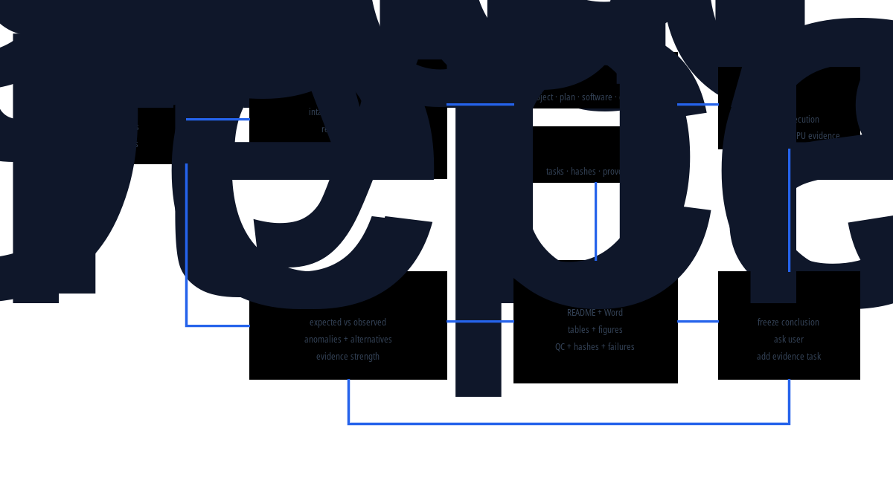
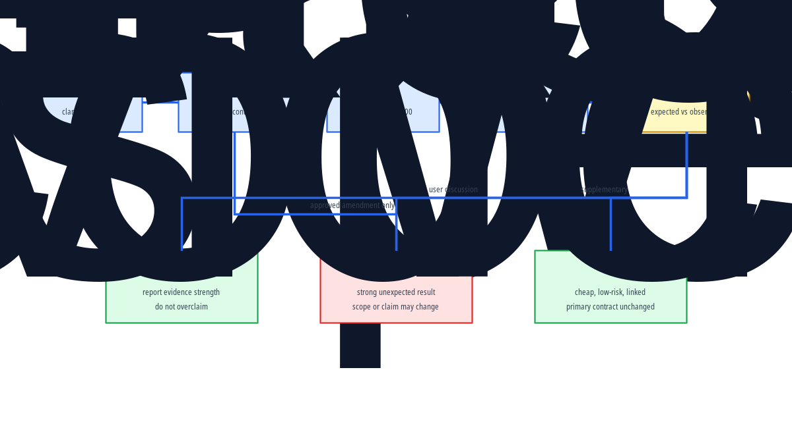

# 可审计科研智能体 Skill 与 Supervisor Agent 使用说明

_面向本项目及后续通用科研项目的架构、使用和审计手册；版本 2026-09-04_

---

## 📋 文档定位

这套系统不是一个单独的模型，也不是一组零散脚本。它由三个层次组成：

| 层次 | 名称 | 作用 |
|---|---|---|
| 可复用能力 | scientific-research-project Skill | 规定科研项目如何启动、规划、执行、审计、反思和交付 |
| 执行控制器 | Supervisor Agent | 读取项目状态，提出澄清问题，选择下一任务，受控调度和审查结果 |
| 项目实例 | molecular representation benchmarking | 当前的 00_PROJECT.md–04_STATUS.md、registry、数据、模型和 results |

因此，Skill 是“可复用方法和规则”，Supervisor 是“运行中的决策与调度主体”，项目文件是“持久化记忆、证据和状态”。

## 🏗️ 总体架构

下面的架构图展示用户意图、Supervisor、五个核心文件、registry/events、H100/V100 和结果反思之间的关系。

~~~mermaid
flowchart LR
    accTitle: Auditable Research Agent
    accDescr: User intent is clarified by the Supervisor, persisted in five project documents and registries, executed on remote GPUs, and returned through QC and evidence-based reflection.

    user_intent[👤 User intent] --> supervisor[🧠 Supervisor Agent]
    supervisor --> root_docs[📋 Five root documents]
    supervisor --> task_registry[💾 Task registry and events]
    supervisor --> remote_compute[🖥️ H100 / V100]
    remote_compute --> result_package[📦 Result package]
    result_package --> qc_review[🔍 QC and reflection]
    qc_review --> decision{Evidence sufficient?}
    decision -->|Yes| freeze[✅ Freeze scoped conclusion]
    decision -->|No, strong discrepancy| discuss[👤 Discuss with user]
    decision -->|No, cheap evidence| supplement[🔄 Add supplementary task]
    discuss --> supervisor
    supplement --> task_registry

    classDef actor fill:#ede9fe,stroke:#7c3aed,stroke-width:2px,color:#3b0764
    classDef process fill:#dbeafe,stroke:#2563eb,stroke-width:2px,color:#1e3a5f
    classDef data fill:#dcfce7,stroke:#16a34a,stroke-width:2px,color:#14532d
    classDef decision fill:#fef9c3,stroke:#ca8a04,stroke-width:2px,color:#713f12
    classDef outcome fill:#dcfce7,stroke:#16a34a,stroke-width:2px,color:#14532d

    class user_intent actor
    class supervisor,remote_compute,qc_review,discuss,supplement process
    class root_docs,task_registry,result_package data
    class decision decision
    class freeze outcome
~~~

*Figure 1: The installed Skill, Supervisor, project state, remote computation, and evidence loop.*

## 🧩 Skill 的组成

Skill 源码位于：

- 项目源码：scientific_agent_design/skills/scientific-research-project/
- 用户级安装：/home/shuifeng/.codex/skills/scientific-research-project/
- Skill 入口：SKILL.md
- 数据结构规范：references/project_schema.md
- 项目 intake：references/intake_protocol.md
- 结果反思：references/reflection_protocol.md
- Supervisor 实现：scripts/supervisor_agent.py
- UI 元数据：agents/openai.yaml

### Skill 解决的问题

Skill 将科研活动固定为一套可重启的磁盘协议：

1. 先理解用户目的，而不是立即执行模型；
2. 用 Qxx 表示科学问题，用 Qxx.xx 表示可执行任务；
3. 让模型、数据、软件、服务器、命令和结果路径预先登记；
4. 将下载、运行、QC、失败和计划修订写成事件；
5. 要求每个结果同时包含方法、数据来源、软件用法、表、图、结论和限制；
6. 对预期不符的结果进行反思，而不是自动把异常解释成成功；
7. 允许低风险高增信的补充实验，但不允许静默改变主要科学合同。

## 🤖 Supervisor Agent 的职责

Supervisor 不是无条件执行器，而是受约束的科研项目控制器。

| 模式 | 输入 | 输出 | 默认权限 |
|---|---|---|---|
| intake | 五个核心文件和用户目标 | 澄清问题、目标解释、未决高影响信息 | 只读 |
| inspect | 根文档、registry、results | 缺失文件、任务状态、结果包完整性 | 只读 |
| plan | 已澄清目标和任务 registry | 下一任务、模型/数据/环境/命令合同 | 只读 |
| execute | 明确命令、服务器和授权 | run.started、run.completed 或 run.failed | 受显式授权 |
| review | 结果目录、QC 和 README | 完整性检查、反思状态、是否可冻结 | 默认只读 |
| reflect | 预期、观察、异常和证据 | 用户讨论项或补充实验候选 | 只读/登记建议 |

Supervisor 不会自行推断下载、提交作业、杀进程、覆盖结果或修改冻结设计的权限。

## 💬 项目启动与用户沟通

### Intake 的必问内容

项目开始或用户目的不清楚时，Supervisor 必须确认：

| 类别 | 需要明确的内容 |
|---|---|
| 决策 | 研究结果最终要支持什么科学或实际决策 |
| 目标 | 需要证明、比较、预测还是排除什么 |
| 假设 | 预期方向、可能的零结果和竞争解释 |
| 范围 | 人群/化学空间、模型、数据、服务器和版本边界 |
| 终点 | 主要终点、次要终点、指标方向和不可合并的 endpoint |
| 纳入 | 全部 eligible 模型、控制组、缺失与排除分母 |
| 设计 | split、泄漏控制、随机种子、外部验证和停止条件 |
| 运维 | 环境、checkpoint、GPU、预算、并行度和时间上限 |
| 交付 | 表、图、Markdown、Word、manifest、hash 和读者对象 |
| 授权 | 哪些动作必须问用户，哪些低风险补充可自主添加 |

### 沟通门禁

- 会改变总体目标、cohort、主要终点、模型纳入或排除规则的问题，必须先询问用户
- 只是实现细节且有安全默认值的问题，可以说明假设后继续
- 计划冻结前，Supervisor 要向用户复述“我理解的目标”和“准备执行的任务树”
- 用户修正必须写入 decisions 或 plan amendment，不能只留在聊天记录

## 🗺️ 任务、结果和状态的对应关系

项目只允许一套科学问题编号：

| ID | 含义 | 示例 |
|---|---|---|
| Q01 | 科学问题 | 常规配体性质预测 |
| Q01.01 | 可执行任务 | ligand-only 正式主榜 |
| Q01.01.R001 | 一次运行 | 第一次 H100 formal run |
| result path | 唯一结果目录 | results/Q01_ligand_property/Q01.01_formal_main_board/ |

任何正式任务必须在 registry/tasks.tsv 预登记。不得新增 stage4、final2、new_results 等平行目录。

## 🔄 Supervisor 生命周期

下面的流程图说明何时继续、何时暂停与用户讨论，以及何时可以自动添加低风险补充实验。

~~~mermaid
flowchart TB
    accTitle: Supervisor Decision Lifecycle
    accDescr: The Supervisor clarifies intent, freezes a task contract, executes remotely, validates outputs, compares expected and observed findings, and either freezes, discusses, or adds supplementary evidence.

    intake([👤 Intake]) --> plan[📋 Freeze task contract]
    plan --> execute[🖥️ Remote execution]
    execute --> qc[🔍 Output and QC]
    qc --> reflect[🤔 Expected versus observed]
    reflect --> decision{What is the discrepancy?}
    decision -->|Within expectation| freeze[✅ Freeze scoped result]
    decision -->|Strong unexpected result| user_discuss[👤 Discuss with user]
    decision -->|Cheap high-value check| extra[🔄 Add linked supplementary task]
    user_discuss --> amend[✏️ Approved amendment]
    amend --> plan
    extra --> qc

    classDef action fill:#dbeafe,stroke:#2563eb,stroke-width:2px,color:#1e3a5f
    classDef decision fill:#fef9c3,stroke:#ca8a04,stroke-width:2px,color:#713f12
    classDef success fill:#dcfce7,stroke:#16a34a,stroke-width:2px,color:#14532d
    classDef warning fill:#fee2e2,stroke:#dc2626,stroke-width:2px,color:#7f1d1d

    class plan,execute,qc,reflect,amend,extra action
    class decision decision
    class intake,freeze success
    class user_discuss warning
~~~

*Figure 2: Decision logic for freezing, discussing, or expanding evidence.*

## 🧪 结果反思协议

每个结果 README 必须回答：

1. 预期是什么，为什么有这个预期；
2. 实际观察到什么，带有什么不确定性；
3. 是否出现异常、失败集中或与常识不符；
4. 有哪些竞争解释；
5. 证据强度是 strong、moderate、weak 还是 not interpretable；
6. 哪些限制阻止外推；
7. 下一步是冻结、补证据、重跑还是询问用户。

### 反思决策表

| 情况 | Supervisor 行为 |
|---|---|
| 结果符合预期且 QC 通过 | 冻结限定范围内结论，报告不确定性 |
| 主要排名反转、泄漏、异常值或失败机制改变结论 | 阻断冻结，与用户讨论竞争解释 |
| 有便宜且高价值的预设检查 | 新增 supplementary task，不改变主要终点 |
| 只是完整性或稳健性缺口 | 可自主添加审计，并标记 secondary/post hoc |
| 技术失败 | 按原合同重试或正式 exclusion，不伪造成功 |

可自主增加的补充证据包括 seed sensitivity、paired bootstrap、missingness audit、calibration、negative control、matched baseline 和 leakage audit。新数据源、新科学主张、昂贵远程运行或改变主要终点仍需用户批准。

## 🔬 与 Co-Scientist 和 Robin 的架构比较

这里比较的是**系统架构和科研工作契约**，不是宣称三者在同一数据集上有可直接比较的性能。Co-Scientist 的核心是围绕科学目标生成、批评、排序和演化假设的异步多智能体系统；论文明确描述了 Generation、Reflection、Ranking、Evolution、Proximity 和 Meta-review 等专门代理，以及 Supervisor 对异步 worker 的资源分配。[^4] Robin 则把文献检索、候选/实验策略生成、实验数据分析和下一轮假设更新连成一个实验室反馈闭环，其中 Crow/Falcon 负责文献，Finch 负责实验数据分析。[^5]

### 一张表看清三者边界

| 比较维度 | 本项目的 Skill + Supervisor | Co-Scientist | Robin |
|---|---|---|---|
| 首要目标 | 让一个科研项目从目标、计划、环境、数据、运行到结论可重启、可审计、可复核 | 在给定科学目标和证据后生成、批评、排序并演化新假设和实验方案 | 将文献假设、实验候选、实验数据分析和下一轮假设连接成半自主发现闭环 |
| 核心控制单元 | 一个受权限约束的 Supervisor + 磁盘上的项目协议 | Supervisor + 异步任务队列 + 多类假设 worker | 一个协调多个领域代理的 discovery workflow |
| 主要 worker | 当前以结果反思、QC、数据/环境/执行审计为主；可插入领域 worker | Generation、Reflection、Ranking、Evolution、Proximity、Meta-review | Crow、Falcon、Finch，以及实验和结果解释环节 |
| 规划起点 | 先做 user-aligned intake，再冻结 Qxx/Qxx.xx、endpoint、cohort、split 和排除规则 | 自然语言科学目标直接进入假设探索与 tournament | 疾病/科学目标进入文献检索、实验策略和候选生成 |
| 计算组织 | 任务 registry、事件日志、H100/V100 主机约束、显式执行授权 | 异步 worker 扩展 test-time compute，并用 tournament 反馈迭代 | 多个分析轨迹并行运行；同一数据可经多条轨迹再做共识整合 |
| 主要产物 | README、Word、表、图、QC、失败/排除表、输入/输出 hash、环境和反思 | 假设、实验方案、排名、引用和迭代后的候选 | 候选/实验建议、分析 notebook、共识结论、后续实验方向 |
| 证据边界 | 将“完成”定义为结果包完整、QC 通过、失败机制可追溯、反思已写入并可冻结 | 强项是文献 grounding、专家反馈、假设竞争与实验验证 | 强项是实验室数据反馈、独立分析轨迹和实验验证 |
| 人类介入位置 | 在目标、重大设计变更、强异常和高风险执行处设门禁；常规低风险补证据可登记后自动完成 | 科学家可持续给目标、约束、反馈并参与假设演化 | 科学家提供目标和实验执行/反馈，系统推动下一轮分析与候选 |
| 可审计性取向 | **最强项**：文件、路径、hash、命令、主机、版本、失败和状态是一等公民 | 论文强调上下文、引用、agent ablation 和 hypothesis tournament；本项目进一步把项目级文件和运行证据固化为硬契约 | 论文强调多轨迹共识、文献引用和实验反馈；本项目补充更严格的 task/result/provenance 目录约束 |
| 当前短板 | 还没有 Co-Scientist/Robin 那样成熟的假设生成、文献 worker 和实验室反馈 worker | 不以本项目这种跨模型 benchmark 的全链条文件审计为首要设计目标 | 不以通用 benchmark 的版本、GPU 调度和失败/排除分母审计为首要设计目标 |

### 三种架构的关系

~~~mermaid
flowchart LR
    accTitle: Architecture Comparison
    accDescr: The project Supervisor is the governance spine; Co-Scientist-style workers add hypothesis generation and tournament refinement; Robin-style workers add literature, experiment and data-analysis feedback.

    intent[👤 User goal] --> spine[🧠 Project Supervisor intake · plan · execute · review · reflect]
    spine --> contract[📋 Frozen project contract Q/task · data · software · endpoint · exclusions]
    contract --> workers[⚙️ Pluggable workers]
    workers --> cs[🔬 Co-Scientist-style generate · critique · rank · evolve]
    workers --> rb[🧪 Robin-style literature · experiment · data analysis]
    workers --> bench[📊 Benchmark-style models · datasets · QC · statistics]
    cs --> evidence[📦 Evidence package]
    rb --> evidence
    bench --> evidence
    evidence --> reflect[🤔 Reflection and discrepancy review]
    reflect -->|freeze| conclusion[✅ Scoped conclusion]
    reflect -->|strong anomaly| intent
    reflect -->|cheap high-value check| workers

    classDef actor fill:#ede9fe,stroke:#7c3aed,stroke-width:2px,color:#3b0764
    classDef control fill:#dbeafe,stroke:#2563eb,stroke-width:2px,color:#1e3a5f
    classDef worker fill:#fef9c3,stroke:#ca8a04,stroke-width:2px,color:#713f12
    classDef evidence fill:#dcfce7,stroke:#16a34a,stroke-width:2px,color:#14532d
    classDef outcome fill:#dcfce7,stroke:#16a34a,stroke-width:2px,color:#14532d

    class intent actor
    class spine,contract,reflect control
    class workers,cs,rb,bench worker
    class evidence evidence
    class conclusion outcome
~~~

### 哪些设计应借鉴，哪些必须保留

| 来源 | 值得借鉴到本项目的设计 | 借鉴后的安全落点 |
|---|---|---|
| Co-Scientist | 专门的 Generation/Reflection/Ranking/Evolution worker；异步任务队列；让多个候选假设相互竞争；把 test-time compute 当作可审计资源 | 每个候选假设、评分、引用、提示版本、worker run 和淘汰原因写入 `registry/` 与 `_evidence/`；不得覆盖预注册 primary endpoint |
| Robin | 文献 worker 与数据分析 worker 分工；同一数据的多条分析轨迹；共识/元分析；实验结果驱动下一轮问题；对后续实验提出具体建议 | 每条轨迹必须保存输入 hash、代码、环境、日志和图表；共识只能汇总可复核轨迹，不能隐藏分歧；昂贵或改变目标的 follow-up 仍需用户授权 |
| 本项目现有架构 | user-aligned intake、五个根文档、Q/task/result 唯一映射、远程主机门禁、失败/排除分母、事件钩子、expected-vs-observed 反思 | 作为所有新增 worker 的治理层，不允许为了提高自主性而取消审计和权限边界 |

### 推荐的下一代混合架构

1. **治理层（保留本项目 Supervisor）**：负责目标澄清、计划冻结、资源和权限、版本/数据/hash、结果包完整性与最终结论门禁。
2. **假设层（引入 Co-Scientist 风格 worker）**：Generation 产生候选问题或机制，Reflection 找反例，Ranking 做成对或 tournament 比较，Evolution 形成下一代候选；每一轮都产生可追踪的 `hypothesis_id`。
3. **证据层（引入 Robin 风格 worker）**：Literature worker 建立引用证据，Data-analysis worker 运行多轨迹分析，Experiment-planning worker 把候选转为可执行实验；所有轨迹回写统一 result package。
4. **benchmark 层（本项目特有）**：统一模型、数据集、环境、GPU、head、五种子评估和 exclusion audit，避免“只跑少数模型”的隐性偏差。
5. **反思层（共同闭环）**：将 expected/observed、异常、竞争解释、证据强度和下一步动作写回结果；强异常与重大设计变化必须回到用户沟通门禁。

这意味着本项目不是简单复制 Co-Scientist 或 Robin，而是把它们的**多代理探索能力**放到一个更严格的**项目级科研操作系统**之中：Co-Scientist 擅长“想出并竞争假设”，Robin 擅长“把文献—实验—数据分析连起来”，本项目 Supervisor 擅长“确保整个过程有目标、有版本、有证据、有失败记录并能被人复核”。

## ⚡ 事件钩子与证据链

每个下载、软件/checkpoint、运行、QC、失败和计划修订都写入 provenance/events.jsonl。

~~~mermaid
sequenceDiagram
    accTitle: Evidence Event Flow
    accDescr: A project event is validated, written to provenance, synchronized into registries and human documents, and either produces a snapshot or a visible sync alert.

    participant U as 👤 User or workflow
    participant H as ⚡ Event hook
    participant R as 💾 Registry
    participant D as 📋 Root documents
    participant O as 📦 Result package

    U->>H: Emit event
    H->>H: Validate path, hash, payload, and task
    H->>R: Append immutable event
    H->>D: Update status and recent event blocks
    H->>O: Update task result evidence
    alt ✅ Consistent
        H-->>U: Snapshot and next action
    else ⚠️ Inconsistent
        H-->>U: Sync alert; preserve previous docs
    end
~~~

事件事务顺序是：event → validation → registry transaction → consistency check → Markdown/Word render → snapshot。任何环节失败都必须产生 documentation_sync_failed 告警。

## 📦 结果包标准

每个正式任务目录都应包含：

| 文件/目录 | 必须说明 |
|---|---|
| README.md | 目的、数据、软件、命令、QC、结果、反思和结论 |
| REPORT.docx | 面向人工审阅的同版报告 |
| tables/ | 可重算的逐任务和汇总表 |
| figures/ | 主要关系和指标的 PDF/PNG 图 |
| _evidence/ | 日志、输入/输出 hash、环境、失败行、QC JSON |

结果必须明确数据来源、软件使用方法、实际服务器、GPU、环境、checkpoint、输入 hash 和排除分母。

## 🛡️ 权限和安全边界

- 本机只做轻量编排、编辑、hash、聚合和报告生成
- H100 用于现代高吞吐模型；V100 用于固定 legacy 环境
- execute 必须同时给出明确命令、目标服务器和授权标志
- 运行退出不等于科学完成
- 失败不得静默重命名为成功
- 不得把缺失、失败或 exclusion 插补成性能值
- 计划修订必须有原因、证据、影响、版本和批准记录

## 🚀 当前项目使用示例

~~~bash
# 只读检查
python /home/shuifeng/.codex/skills/scientific-research-project/scripts/supervisor_agent.py \
  inspect --root /media/shuifeng/data2T/Project_Benchmarking_molecular_representation

# 启动 intake
python /home/shuifeng/.codex/skills/scientific-research-project/scripts/supervisor_agent.py \
  intake --root /media/shuifeng/data2T/Project_Benchmarking_molecular_representation

# 选择下一任务
python /home/shuifeng/.codex/skills/scientific-research-project/scripts/supervisor_agent.py \
  plan --root /media/shuifeng/data2T/Project_Benchmarking_molecular_representation

# 反思指定结果
python /home/shuifeng/.codex/skills/scientific-research-project/scripts/supervisor_agent.py \
  reflect --root /media/shuifeng/data2T/Project_Benchmarking_molecular_representation \
  --task-id Q01.01
~~~

当前项目中，Supervisor 会选择 Q01.02 作为下一项正式任务；它不会因为 Q01.01 已完成就跳过低数据问题。

## ✅ 验证状态

- Skill 官方 quick_validate：通过
- 用户级安装副本：已安装
- Supervisor intake：通过
- Supervisor plan：正确选择 Q01.02
- Supervisor review/reflect：Q01.01 结果包和反思字段通过
- 本文档生成：Markdown、DOCX、PDF 三种格式

## 📚 参考与项目文件

- [项目目标](../../00_PROJECT.md)
- [详细计划](../../01_PLAN.md)
- [软件部署](../../02_SOFTWARE.md)
- [数据清单](../../03_DATA.md)
- [项目状态](../../04_STATUS.md)
- [Skill 入口](../skills/scientific-research-project/SKILL.md)
- [Supervisor 源码](../skills/scientific-research-project/scripts/supervisor_agent.py)
- [事件钩子](../../scripts/hooks/project_event.py)
- [Mermaid 文档](https://mermaid.js.org/)[^1]
- [Co-Scientist](https://www.nature.com/articles/s41586-026-10644-y)[^2]
- [Robin](https://www.nature.com/articles/s41586-026-10652-y)[^3]

[^1]: Mermaid. “Mermaid Diagramming and Charting Tool.” https://mermaid.js.org/
[^2]: Gottweis, J. et al. (2026). “Accelerating scientific discovery with Co-Scientist.” Nature. https://www.nature.com/articles/s41586-026-10644-y
[^3]: Ghareeb, A. E. et al. (2026). “A multi-agent system for automating scientific discovery.” Nature. https://www.nature.com/articles/s41586-026-10652-y
[^4]: Gottweis, J. et al. (2026). “Accelerating scientific discovery with Co-Scientist.” Nature, abstract and system overview. https://www.nature.com/articles/s41586-026-10644-y
[^5]: Ghareeb, A. E. et al. (2026). “A multi-agent system for automating scientific discovery.” Nature, abstract and Robin workflow. https://www.nature.com/articles/s41586-026-10652-y
