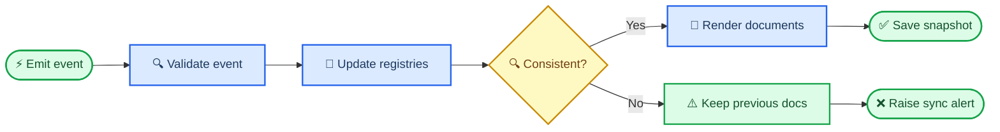

# Event-hook specification

_Synchronizes downloads, environments, runs, results, plans, status, and reports._

---

## ⚡ Event contract

Every event contains `event_id`, `event_type`, `timestamp`, `project_id`, `question_id`, optional `task_id`/`run_id`, actor, payload, artifact paths, hashes, and idempotency key. Append events to `provenance/events.jsonl` before rendering documents.

## 🔄 Update transaction

## 📋 Mandatory hooks

| Event | Required updates |
|---|---|
| Data downloaded/verified/standardized | `03_DATA.md`, `04_STATUS.md`, data registry |
| Software downloaded/installed/smoked | `02_SOFTWARE.md`, `04_STATUS.md`, software registry |
| Run started/progressed/failed | `04_STATUS.md`, run registry, task evidence |
| Run and QC completed | `01_PLAN.md`, `04_STATUS.md`, task README, tables/figures, Word report |
| Evidence gap or contradiction | `04_STATUS.md`, result reflection, amendment draft |
| Plan amendment approved | `01_PLAN.md`, task registry, decision ledger, affected result README |

No hook may silently alter a frozen objective, primary endpoint, cohort, method, or exclusion rule.

